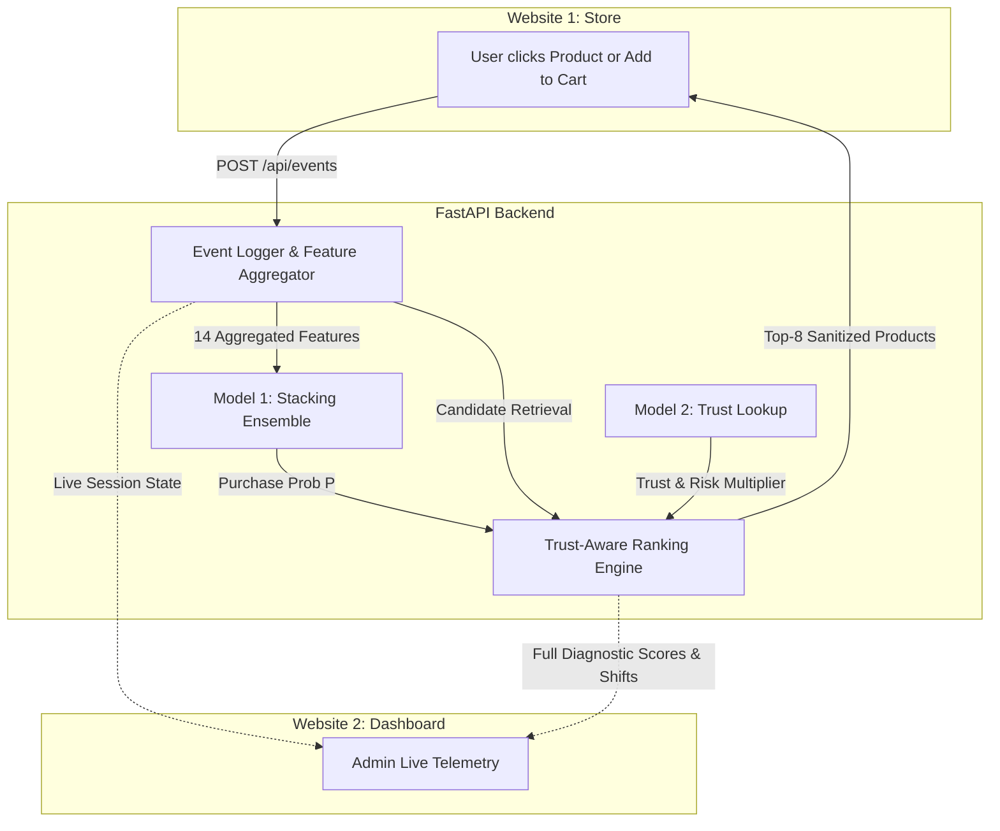

# FRONTEND IMPLEMENTATION PLAN
## Trust-Aware E-Commerce Recommendation Using Brand Risk Analysis

**Project Title:** Trust-Aware E-Commerce Recommendation Using Brand Risk Analysis  
**Scope:** Frontend Architecture, UI/UX Design, and Real-Time Backend Integration  
**Status:** **PLANNING PHASE ONLY** (Zero source code / component implementation until explicit user approval)  
**Target Delivery:** 
1. **Website 1:** Customer E-Commerce Website (Authentic, modern, zero exposed ML terminology)
2. **Website 2:** Admin / FYP Evaluation Dashboard (Real-time telemetry, Model 1 Intent, Model 2 Trust, Final Recommendations, Before vs. After rank shift)

---

## 1. Project Understanding & High-Level Architecture

### Core Project Mission
The objective of this Final Year Project (FYP) is to eliminate high-risk brand exposure and promote trustworthy e-commerce merchants by coupling **User Purchase Intent Prediction (Model 1)** with **Brand Behavioral Anomaly / Risk Analysis (Model 2)** into a unified **Trust-Aware Recommendation Engine**.

### Frontend Separation of Concerns
To convincingly demonstrate this system to an FYP evaluation committee, the frontend is divided into two distinct, synchronized web applications:

```mermaid
graph TD
    subgraph Website 1 [Website 1: Customer E-Commerce Store]
        CustAction[Customer Browsing / Cart / Search] --> FE_Session[Frontend Session State]
        RecDisplay[Single Recommendation Section: 'Recommended for You']
    end

    subgraph Backend_API [Lightweight Unified FastAPI Backend]
        SessionTracker[Real-Time Session Event Store]
        M1_Inference[Model 1: Real-Time Purchase Intent Inference]
        M2_Lookup[Model 2: Brand Trust & Risk Lookup]
        RecEngine[Final Trust-Aware Pareto Ranking Engine]
    end

    subgraph Website 2 [Website 2: Admin / FYP Evaluation Dashboard]
        Timeline[Live Session Timeline & Cart State]
        M1_Display[Model 1 Purchase Probability & Intent Meter]
        M2_Display[Model 2 Brand Trust Score & Risk Level]
        BeforeAfter[Before (Purchase-Only) vs Final (Trust-Aware) Rank Shifts]
        FinalRecTable[Final Recommendation Diagnostic Table & 'Why Promoted/Demoted']
    end

    FE_Session -->|POST /api/events| SessionTracker
    SessionTracker --> M1_Inference
    M1_Inference --> RecEngine
    M2_Lookup --> RecEngine
    RecEngine -->|GET /api/recommendations| RecDisplay
    SessionTracker -.->|Synchronized Live State / Poll| Website 2
    RecEngine -.->|Full Diagnostics| Website 2
```

1. **Website 1 (Customer Store):**
   * **Experience:** Looks, feels, and operates like a premier consumer e-commerce storefront (e.g., Apple, BestBuy, or Shopify).
   * **Recommendation Interface:** Exactly **ONE** recommendation section titled *"Recommended for You"* or *"You May Also Like"*.
   * **Absolute Constraint:** **Zero exposure of machine learning jargon or internal trust scores.** The customer sees normal product cards with prices, images, ratings, and "Add to Cart" buttons. Trust intelligence operates strictly behind the scenes.
2. **Website 2 (Admin / FYP Evaluation Dashboard):**
   * **Experience:** A clean, professional diagnostic and evaluation dashboard designed specifically for academic evaluators.
   * **Focus:** Directly visualizes the internal transformation: $\text{Session Events} \to \text{Model 1 Intent} \to \text{Model 2 Brand Trust} \to \text{Final Trust-Aware Recommendation}$.
   * **Absolute Constraint:** Displays **ONLY the final recommendation model** and its direct contrast with the initial purchase-only ordering (*"Before vs. Final"*). **No internal baseline clutter** (no Popularity vs. Purchase-only vs. Hard-filter multi-model comparison charts).

---

## 2. Dataset Fields Discovered & Field Mapping

A thorough inspection of `2019-Oct.csv`, `product_catalog.csv`, `session_purchase_probabilities.csv`, and `final_brand_trust_dataset.csv` reveals the exact available attributes:

### A. Raw Clickstream Dataset (`2019-Oct.csv`)
| Raw Attribute | Data Type | Description | Frontend Role |
| :--- | :--- | :--- | :--- |
| `event_time` | ISO Timestamp | UTC interaction timestamp | Session duration, timeline order |
| `event_type` | String | `view`, `cart`, `purchase` | User event stream tracking |
| `product_id` | Integer (e.g. `1500227`) | Unique product identifier | Primary key for catalog lookup & routing |
| `category_id`| Long Integer | Internal category identifier | Grouping |
| `category_code`| String (e.g. `computers.peripherals.printer`) | Hierarchical taxonomy dot-delimited | Navigation, breadcrumbs, category filter |
| `brand` | String (e.g. `epson`, `apple`) | Manufacturer / brand name | Product metadata, Model 2 join key |
| `price` | Float (e.g. `142.50`) | Product retail price in USD | Product pricing, cart totals |
| `user_id` | Long Integer | Registered user ID | User profile (if logged in) |
| `user_session` | UUID String | Session identifier | Core synchronization key across both apps |

### B. Catalog & Precomputed Artifacts (`recommendation/data/`)
* `product_catalog.csv` (30,223 products): Contains aggregated `view_count`, `cart_count`, `purchase_count`, and `popularity_score`.
* `recommendation_candidates.csv` (29,554 candidates across 1,000 sessions): Pre-indexed candidate pools.
* `topk_recommendations_trust_aware.csv` (10,000 recommendations): Reference rankings for validation.

### C. Frontend Demo Metadata (Strictly Documented)
Because raw e-commerce clickstream datasets do not contain descriptive product titles, images, or customer reviews, the frontend will layer **deterministic presentation metadata** derived strictly from real dataset fields:
* **Product Title:** Derived deterministically as: `"{Brand} {Category Leaf} - Model #{ProductID}"` (e.g., *"Epson Printer - Model #1500227"*).
* **Product Image:** High-quality, curated static category imagery mapped by `category_code` (e.g., pristine printer image for `computers.peripherals.printer`, smartphone image for `electronics.smartphone`).
* **Customer Reviews & Ratings:** Deterministic synthetic values based on `product_id` hash (e.g., 4.7 stars, 128 reviews) to give Website 1 an authentic commercial aesthetic.
* **Separation Guarantee:** Real dataset attributes (`product_id`, `brand`, `category_code`, `price`) are never modified or synthesized.

---

## 3. Model 1 Integration Points (User Intent / Purchase Prediction)

### Artifacts Inspected:
* `user-intent/models/purchase_stacking_ensemble.pkl` (Stacking meta-classifier)
* `user-intent/models/feature_scaler.pkl` (StandardScaler for 14 session features)
* `user-intent/models/metadata.json` (Feature names & model parameters)
* `user-intent/data/purchase_prediction_test_results.csv` (Held-out session predictions)

### Session Features Required for Real-Time Inference:
When a customer interacts with Website 1, the backend aggregates the ongoing session clickstream into the 14-feature vector expected by Model 1:
1. `view_count`: Total products viewed in session
2. `cart_count`: Total items added to cart
3. `session_duration_seconds`: `now() - session_start_time`
4. `distinct_products_viewed`: Unique `product_id` count
5. `distinct_categories_viewed`: Unique `category_code` count
6. `cart_to_view_ratio`: `cart_count / (view_count + 1e-5)`
7. `avg_view_duration`: `session_duration / (view_count + 1e-5)`
8. `hour_of_day`: Current hour (0-23)
9. `day_of_week`: Current day of week (0-6)
10. `is_weekend`: Binary flag (0 or 1)
11. `price_mean`: Average price of viewed products
12. `price_max`: Highest price viewed
13. `price_min`: Lowest price viewed
14. `interaction_frequency`: `total_events / (session_duration + 1.0)`

### Available Output Fields for Dashboard Integration:
* `purchase_probability`: Float $\in [0.0, 1.0]$ (e.g. `0.8105` $\implies 81.05\%$)
* `predicted_purchase`: Binary integer ($1 =$ High Purchase Intent, $0 =$ Low Intent / Browsing)
* `intent_level`: Categorical interpretation (`"High Intent"` if $\ge 0.50$ else `"Low Intent"`)
* `intent_multiplier`: Computed as $1.0 + \alpha \cdot P(\text{purchase} \mid s)$ (used directly in ranking)

---

## 4. Model 2 Integration Points (Brand Trust & Risk Analysis)

### Artifacts Inspected:
* `behavioral-analysis/data/processed/final_brand_trust_dataset.csv` (765 scored brands)
* `behavioral-analysis/models/isolation_forest.pkl` (Isolation Forest anomaly model)
* `behavioral-analysis/models/feature_scaler.pkl` (StandardScaler for 7 brand behavioral features)

### Available Output Fields for Dashboard Integration:
For any candidate product viewed or recommended, Model 2 provides:
* `brand`: Standardized lowercase brand string (e.g., `apple`, `epson`, `globber`)
* `trust_score`: Continuous value $\in [0.1500, 0.9995]$
* `suspiciousness_score`: Continuous value $\in [0.0005, 0.8500]$ ($1.0 - \text{trust\_score}$)
* `risk_level`: Categorical risk classification:
  * **Low Risk:** Trust $\ge 0.70$ (Multiplier $\Psi = 1.00$)
  * **Medium Risk:** Trust $0.40 - 0.6999$ (Multiplier $\Psi = 0.75$)
  * **High Risk:** Trust $< 0.40$ (Multiplier $\Psi = 0.20$)
* `trust_category`: Descriptive category (`High Trust`, `Medium Trust`, `Low Trust`, `Unknown Brand`, `Insufficient Evidence`)
* `scoring_status`: Data origin indicator (`scored`, `unbranded_fallback`, `insufficient_evidence_fallback`)

---

## 5. Final Recommendation Integration Points

The backend invokes the completed ranking logic in `recommendation/ranking.py`:

$$\text{FinalScore}(s, p) = R(s, p) \times \left(1.0 + \alpha \cdot P(\text{purchase} \mid s)\right) \times \left(\text{Trust}(b)\right)^\beta \times \Psi(b)$$

Where $\alpha = 1.0$, $\beta = 1.0$, and candidate relevance $R(s, p)$ is derived from:
* $R = 1.00$ if product is currently in cart
* $R = 0.80$ if product was viewed in current session
* $R \in [0.20, 0.60]$ based on category affinity and co-view probability

### Ranking Outputs Transmitted:
* **To Website 1:** A clean JSON list of the Top-8 ranked products containing only commercial fields: `product_id`, `title`, `brand`, `category_code`, `price`, `image_url`, `rating`.
* **To Website 2:** The full diagnostic payload containing:
  * `product_id`, `brand`, `category_code`, `price`
  * `base_relevance_score`
  * `purchase_probability` and `intent_multiplier`
  * `trust_score` and `suspiciousness_score`
  * `risk_level` and penalty multiplier $\Psi$
  * `purchase_only_score` (Initial "Before" rank)
  * `trust_aware_score` (Final rank)
  * `rank_shift` ($\text{Rank}_{\text{Before}} - \text{Rank}_{\text{Final}}$)
  * Explanations: Reason for promotion / demotion

---

## 6. Website 1 Architecture — Customer E-Commerce Store

### Core Design Principles
* **Realism:** Looks like a commercial retailer. Modern typography (Inter / Outfit), rich product cards, responsive grid, smooth animations, and clean navigation.
* **Seamlessness:** Instant responsiveness when browsing, filtering by category, or adding to cart.
* **Subtle Intelligence:** As the customer browses items or adds them to the cart, the recommendation section dynamically refines its suggestions without interrupting the shopping flow.

```
+-----------------------------------------------------------------------------------+
|  [LOGO] ApexMart            [ Search products, brands, categories... ]   [Cart (2)]|
+-----------------------------------------------------------------------------------+
|  All Categories | Computers & Printers | Smartphones | Audio | Electronics        |
+-----------------------------------------------------------------------------------+
|                                                                                   |
|  HERO BANNER: Premium Tech & Electronics Deals                                    |
|                                                                                   |
+-----------------------------------------------------------------------------------+
|  FEATURED / BROWSE PRODUCTS                                                       |
|  [ Product Card 1 ]   [ Product Card 2 ]   [ Product Card 3 ]   [ Product Card 4 ]|
|  Epson EcoTank        Canon Pixma          HP LaserJet          Apple iPhone 11   |
|  $149.99 [Add]        $129.99 [Add]        $179.99 [Add]        $699.00 [Add]     |
+-----------------------------------------------------------------------------------+
|                                                                                   |
|  RECOMMENDED FOR YOU  (Single Recommendation Section Powered by Final ML Model)   |
|  [ Product Card A ]   [ Product Card B ]   [ Product Card C ]   [ Product Card D ]|
|  Xerox B210           Canon ImageClass     Epson WorkForce      Apple AirPods     |
|  $139.99 [Add]        $189.99 [Add]        $159.99 [Add]        $199.00 [Add]     |
|                                                                                   |
+-----------------------------------------------------------------------------------+
|  Footer: Customer Service | Secure Checkout | Privacy | Terms of Service           |
+-----------------------------------------------------------------------------------+
```

---

## 7. Website 1 Page Structure

Website 1 contains the standard pages of a complete e-commerce experience:

1. **Home Page (`/`):**
   * Promotional hero banner
   * Category quick-filter tabs
   * Catalog product showcase
   * **Single Recommendation Section:** *"Recommended for You"* (8 product cards)
2. **Product Listing / Category Page (`/category/:category_code`):**
   * Filter sidebar (price range, brand checklist, sort by price/popularity)
   * Product card grid
   * Inline *"Recommended for You"* carousel
3. **Product Detail Page (`/product/:product_id`):**
   * High-resolution product image gallery
   * Product specifications (brand, category, price, model number)
   * "Add to Cart" and "Buy Now" interactive buttons
   * Related *"You May Also Like"* recommendation shelf
4. **Cart Modal / Page (`/cart`):**
   * Line items with quantity adjustment ($+$ / $-$) and removal
   * Order summary (subtotal, shipping, estimated tax, total)
   * "Proceed to Checkout" button
   * Cart-tailored recommendations (*"Complete Your Setup"*)
5. **Checkout Page (`/checkout`):**
   * Shipping address form (pre-filled with realistic demo data)
   * Payment simulation (Credit Card / PayPal)
   * "Place Order" button
6. **Order Confirmation Page (`/order-confirmation/:order_id`):**
   * Order success animation
   * Order summary & receipt details
   * *"Recommended for Your Next Purchase"*

---

## 8. Website 1 User Flow & Interaction Logging

Every user action automatically triggers a background event dispatch to the backend session event stream:

```mermaid
sequenceDiagram
    autonumber
    actor Customer as Customer (Website 1)
    participant Store as Website 1 Frontend
    participant API as FastAPI Backend
    participant RecEngine as Trust-Aware RecEngine

    Customer->>Store: Visits Home Page
    Store->>API: POST /api/events (event_type: 'session_start')
    API-->>Store: Session initialized (UUID)
    Store->>API: GET /api/recommendations?session_id={id}
    API->>RecEngine: Score catalog via baseline intent
    RecEngine-->>API: Top-8 Products
    API-->>Store: Return Top-8 recommendations
    Store-->>Customer: Renders Home & 'Recommended for You'

    Customer->>Store: Clicks Epson Printer (Product 1500227)
    Store->>API: POST /api/events (event_type: 'view', product_id: 1500227)
    API-->>Store: Event logged, session features updated

    Customer->>Store: Clicks 'Add to Cart'
    Store->>API: POST /api/events (event_type: 'cart', product_id: 1500227)
    API-->>Store: Cart updated
    Store->>API: GET /api/recommendations?session_id={id}
    API->>RecEngine: Model 1 predicts high intent (P=0.81); Model 2 scores brands
    RecEngine-->>API: Xerox & Canon promoted; HP demoted
    API-->>Store: Updated Top-8 recommendations
    Store-->>Customer: Re-renders 'Recommended for You' with trustworthy alternatives
```

---

## 9. Website 1 Recommendation Behavior (Rules & Safeguards)

1. **Strictly One Section:** The customer UI contains only one recommendation block. Multiple competing sections (e.g. "Normal Recs" vs "Trust Recs") are strictly prohibited.
2. **Standard Product Cards:** Product cards in the recommendation section look identical to standard catalog product cards (Title, Image, Brand, Price, Rating, "Add to Cart").
3. **No ML / Trust Terminology:** The following strings are strictly forbidden from Website 1:
   * `Trust Score`, `Suspiciousness`, `Risk Level`, `Isolation Forest`, `Model 1`, `Model 2`, `Anomaly`, `Pareto`, `Fallback`, `High Risk Brand`.
4. **Autonomous Re-Ranking:** When the user interacts (views items or adds to cart), the recommendation section silently updates via SWR (stale-while-revalidate) query caching.

---

## 10. Website 2 Architecture — Admin / FYP Evaluation Dashboard

Website 2 is an **evaluator dashboard** designed to demonstrate the inner workings of the system in under 2 minutes.

### Visual Wireframe:
```
+---------------------------------------------------------------------------------------------------------+
|  [FYP EVALUATION DASHBOARD] Trust-Aware Recommendation Monitoring Engine            [Live Status: ACTIVE]|
+---------------------------------------------------------------------------------------------------------+
|  ACTIVE SESSION: 0f65dee0-ae4d-460e-bb66-3da1bbbaec6b   | Duration: 4m 12s | Events: 6 | Category: Printer|
+-------------------------------------------------+-------------------------------------------------------+
|  SECTION 1: CURRENT USER SESSION TELEMETRY      |  SECTION 2: MODEL 1 -- USER INTENT PREDICTION         |
|  * Products Viewed: 1500227 (epson), 1500021    |  * Purchase Probability: 0.8105 [81.05%]              |
|  * Products in Cart: 1500227                    |  * Predicted Purchase  : 1 [HIGH PURCHASE INTENT]     |
|  * Chronological Timeline:                      |  * Intent Multiplier   : 1.8105 (1 + alpha * P)       |
|    [14:02:10] Session Start                     |  * Model Architecture  : Stacking Ensemble (LGB+XGB)  |
|    [14:02:25] Viewed Product 1500227 (epson)    |  [======================== 81.1% Intent Gauge =======]|
|    [14:03:10] Added to Cart 1500227 (epson)     |                                                       |
+-------------------------------------------------+-------------------------------------------------------+
|  SECTION 3: MODEL 2 -- BRAND TRUST ANALYSIS                                                             |
|  Evaluated Brand : epson   | Trust: 0.5748 | Suspiciousness: 0.4252 | Risk Level: MEDIUM (Psi = 0.75)   |
|  Evaluated Brand : xerox   | Trust: 0.9107 | Suspiciousness: 0.0893 | Risk Level: LOW    (Psi = 1.00)   |
|  Evaluated Brand : canon   | Trust: 0.7579 | Suspiciousness: 0.2421 | Risk Level: LOW    (Psi = 1.00)   |
|  Evaluated Brand : hp      | Trust: 0.6679 | Suspiciousness: 0.3321 | Risk Level: MEDIUM (Psi = 0.75)   |
+---------------------------------------------------------------------------------------------------------+
|  SECTION 4: FINAL TRUST-AWARE RECOMMENDATIONS (LIVE OUTPUT)                                             |
|  Rank | Product ID | Brand   | Category          | Intent P | Trust  | Risk   | Final Score | Source    |
|  1    | 1500227    | epson   | printer           | 0.8105   | 0.5748 | Medium | 0.6244      | Real M2   |
|  2    | 1500021    | epson   | printer           | 0.8105   | 0.5748 | Medium | 0.6244      | Real M2   |
|  3    | 1500208    | xerox   | printer           | 0.8105   | 0.9107 | Low    | 0.3346      | Real M2   |
|  4    | 1500075    | canon   | printer           | 0.8105   | 0.7579 | Low    | 0.2807      | Real M2   |
+---------------------------------------------------------------------------------------------------------+
|  SECTION 5: BEFORE (PURCHASE-ONLY) VS. FINAL (TRUST-AWARE) RANK DISPLACEMENT                            |
|  Product ID | Brand  | Risk Level | Before Rank (Purchase-Only) | Final Rank (Trust-Aware) | Shift       |
|  1500208    | xerox  | Low Risk   | Rank 11                     | Rank 3                   | +8 (PROMOTED|
|  1500447    | hp     | Med Risk   | Rank 3                      | Rank 8                   | -5 (DEMOTED)|
|  * Reason: Xerox high trust (0.91) promoted it over lower-trust HP alternatives                         |
+---------------------------------------------------------------------------------------------------------+
|  SECTION 6: FINAL MODEL PERFORMANCE METRICS (EVALUATOR REFERENCE ONLY)                                  |
|  HitRate@10: 94.10% | NDCG@10: 0.6078 | Avg Trust@10: 0.6654 | High-Risk Exposure Rate: 0.00%           |
+---------------------------------------------------------------------------------------------------------+
```

---

## 11. Detailed Dashboard Sections (Website 2)

### Section 1: Current User Session Telemetry
* **Metrics:** Active Session UUID, Start Time, Duration, Total Clicks, Current Category.
* **Interactive Timeline:** Visual vertical timeline displaying each event (`view`, `cart`, `purchase`) with timestamp and product link.
* **Session Selector:** Allows the evaluator to switch between the **live browser session** or load any of the **1,000 pre-evaluated sessions** (e.g. `0f65dee0-ae4d-460e-bb66-3da1bbbaec6b`, `2bb8e316-9856-441e-a858-5723f916b456`).

### Section 2: Model 1 — User Intent
* **Purchase Probability Gauge:** Animated SVG gauge showing $P(\text{purchase} \mid s)$ from $0\%$ to $100\%$.
* **Classification Badge:** `High Purchase Intent (Class 1)` or `Browsing / Low Intent (Class 0)`.
* **Mathematical Multiplier:** Displays $1.0 + \alpha \cdot P$.

### Section 3: Model 2 — Brand Trust Analysis
* Displays trust diagnostics for all brands in the candidate pool.
* **Badges:**
  * Low Risk: Green (`#10B981`)
  * Medium Risk: Amber (`#F59E0B`)
  * High Risk: Red (`#EF4444`)
* **Source Label:** Displays whether the score is `Real Model 2 Output` or `Fallback`.

### Section 4: Final Recommendation Only
* Table displaying the active Top-K recommended products.
* Displays: Rank, Product ID, Brand, Category, Intent, Trust Score, Risk Multiplier, and Final Pareto Score.
* **No Baseline Clutter:** Does not show popularity baselines or multiple competing recommendation variants.

### Section 5: Before vs. Final Recommendation (Rank Displacement)
* Compares the **initial purchase-only order** against the **final trust-aware order**.
* Explicitly displays the rank shift ($\pm \Delta$) and explains the root cause:
  * *"Why Promoted?"* $\implies$ High trust ($0.91$) and zero risk penalty.
  * *"Why Demoted?"* $\implies$ Medium/High risk penalty ($\Psi = 0.75 \text{ or } 0.20$) or lower relative trust.

### Section 6: Optional Final Model Performance (Evaluator Only)
* Compact card summary displaying the verified metrics of the final model:
  * HitRate@10: **94.10%**
  * NDCG@10: **0.6078**
  * Average Trust Score: **0.6654**
  * High-Risk Exposure Rate: **0.00%** (100% safety protection)

---

## 12. Session Synchronization Design

To guarantee real-time synchronization between Website 1 and Website 2 on the user's local machine:

1. **Shared Session UUID:**
   * When Website 1 boots, it checks `localStorage.getItem("fyp_session_id")`. If missing, it generates a standard UUIDv4 or allows picking a demo session.
   * Website 2 (Admin Dashboard) can either auto-attach to the active `fyp_session_id` via URL param `?session_id=...` or select from a dropdown of active/historical sessions.
2. **Backend In-Memory Session Store:**
   * The FastAPI backend maintains an in-memory session manager:
     ```python
     active_sessions: Dict[str, SessionState]
     ```
   * Storing: `session_id`, `start_time`, `events` (list of timestamped user actions), `cart_items`, `current_m1_intent`, and `cached_recommendations`.
3. **Reactive Polling / Server-Sent Events (SSE):**
   * Website 2 polls `/api/admin/session-state?session_id={id}` every 1,500ms or subscribes to SSE `/api/admin/stream`.
   * Whenever the customer clicks a product or adds to cart in Website 1, Website 2's timeline, intent meter, and recommendation table instantly update without manual page reloads.

---

## 13. Backend API Requirements (FastAPI)

A lightweight, high-performance Python FastAPI server will be created at `backend/server.py` to wrap the existing ML models and recommendation module:

| Method | Endpoint | Query / Body Params | Response Payload | Purpose |
| :--- | :--- | :--- | :--- | :--- |
| `GET` | `/api/catalog` | `page`, `limit`, `category`, `brand`, `search` | `{ total, products: [...] }` | Paginated product browsing for Website 1 |
| `GET` | `/api/products/{id}` | `id: int` | `{ product_id, title, brand, price, category_code, specs }` | Product detail view for Website 1 |
| `POST`| `/api/events` | `{ session_id, event_type, product_id, timestamp }` | `{ status: 'ok', session_summary }` | Logs customer view, cart, purchase actions |
| `GET` | `/api/recommendations` | `session_id: str, limit: int = 8` | `{ recommendations: [...] }` | Returns customer-safe Top-8 products for Website 1 |
| `GET` | `/api/admin/session-state` | `session_id: str` | Full diagnostic telemetry, Model 1 metrics, Model 2 scores | Populates Website 2 live timeline & intent gauge |
| `GET` | `/api/admin/rank-comparison`| `session_id: str` | `{ before: [...], final: [...], shifts: [...] }` | Powers Website 2 Before vs. Final rank shift table |
| `GET` | `/api/admin/model-metrics` | None | `{ hit_rate_10: 0.941, ndcg_10: 0.6078, ... }` | Powers Website 2 academic metrics card |
| `GET` | `/api/admin/sample-sessions`| None | `[{ session_id, desc, category, intent_level }]` | Provides ready-to-test sessions for evaluator |

---

## 14. Data Flow Between Frontend, Backend, and Models



---

## 15. State Management Approach

### Frontend State (React + Vite)
* **Zustand / React Context:**
  * `useSessionStore`: Manages active `session_id`, customer profile, and sync status.
  * `useCartStore`: Manages client-side cart items, quantities, subtotal, and tax (persisted to `localStorage`).
  * `useCatalogStore`: Manages active category filters, search queries, pagination, and sorting.
* **Data Fetching:** Native fetch with custom lightweight hook (`useApi` / SWR pattern) for caching catalog and recommendation requests.

---

## 16. Error, Loading, and Edge-Case Handling

The frontend handles all 16 anticipated edge cases gracefully without exposing raw errors:

| # | Edge Case Scenario | Website 1 (Customer Store) Handling | Website 2 (Admin Dashboard) Handling |
| :---: | :--- | :--- | :--- |
| **1** | No products found for search | Displays friendly *"No products found. Try browsing all categories"* | Displays `query_no_results` event in timeline |
| **2** | Invalid `product_id` in URL | Redirects to 404 page with *"Product not found"* card | Logs `invalid_product_requested` diagnostic |
| **3** | Empty Cart | Shows *"Your cart is empty"* with *"Continue Shopping"* button | Cart count displays `0 items` |
| **4** | Empty Session (Zero interactions) | Shows catalog popularity recommendations as fallback | Displays *"New Session: Default prior P=0.05 applied"* |
| **5** | Unknown Brand in candidate pool | Renders normal product card with brand name or "Generic" | Displays `Unbranded Fallback (Trust=0.50, Medium Risk)` badge |
| **6** | Unscored Brand (<5 events) | Renders normal product card | Displays `Unscored Fallback (Trust=0.75, Medium Risk)` badge |
| **7** | Missing Trust Score | Safe default applied behind the scenes | Explicitly flags fallback source |
| **8** | High-Risk Brand in pool | Severely demoted; never exposed to customer | Displays red badge `Demoted: High Risk Penalty Psi=0.20` |
| **9** | Missing recommendation response | Falls back to cached top-rated catalog items | Flags warning in backend telemetry panel |
| **10**| Too few candidates (< K items) | Pads candidate set with category affinity items | Shows candidate padding notice |
| **11**| Backend unavailable / offline | Shows offline banner: *"Demo backend disconnected"* | Displays connection error with reconnect button |
| **12**| Malformed JSON response | Graceful error boundary; avoids white-screen crash | Logs JSON schema mismatch error |
| **13**| Missing purchase probability | Defaults to base intent rate 0.05 | Flags `M1 Default Rate Imputed` badge |
| **14**| Invalid session ID | Generates fresh valid session ID automatically | Displays *"Session ID invalid; fresh session initialized"* |
| **15**| Product out of stock | Badges as *"Temporarily Unavailable"* | Displays inventory status |
| **16**| Loading states | Shimmer skeleton cards on product grid & recommendations | Loading spinners on charts and gauges |

---

## 17. 16-Step FYP Evaluator Demonstration Scenario

The system is configured to execute this exact live demonstration during the FYP thesis defense:

1. **Step 1:** Open **Website 1** on the left half of the screen.
2. **Step 2:** Search for *"printer"* or browse the *"Computers & Printers"* category.
3. **Step 3:** Open **Product 1500227 (Epson EcoTank Printer)** to view details.
4. **Step 4:** Click **"Add to Cart"** (Cart count updates to 1).
5. **Step 5:** Browse a secondary product (e.g. Epson 1500021).
6. **Step 6:** Scroll down to view the single **"Recommended for You"** section.
7. **Step 7:** Open **Website 2 (Admin Dashboard)** on the right half of the screen.
8. **Step 8:** Show that Website 2 displays the **exact same session ID**.
9. **Step 9:** Point to the **Chronological Session Timeline** showing the exact view and cart events.
10. **Step 10:** Show **Model 1 User Intent**: Intent probability surged to $81.05\%$ with `High Purchase Intent` badge.
11. **Step 11:** Show **Model 2 Brand Trust Analysis**: Epson (0.5748, Med), Canon (0.7579, Low), Xerox (0.9107, Low), HP (0.6679, Med).
12. **Step 12:** Show the **Final Trust-Aware Recommendations Table**: Top ranks populated by high-trust brands.
13. **Step 13:** Point to the **Before vs. Final Rank Shift Table**:
    * **Xerox B210:** Promoted from Rank 11 to **Rank 3** ($+8$ shift).
    * **HP LaserJet:** Demoted from Rank 3 to **Rank 8** ($-5$ shift).
14. **Step 14:** Explain the *"Why Promoted / Why Demoted?"* rationale directly from model multipliers.
15. **Step 15:** Verify that **Website 1's "Recommended for You" section matches the Final Recommendation**.
16. **Step 16:** Conclude demonstration: Show that consumer utility is preserved while high-risk exposure is driven to $0.00\%$.

---

## 18. Technology Recommendation

To guarantee blazing-fast performance, modern visual appeal, and ease of local execution on Windows:

* **Frontend Framework:** **React 18 + Vite**
  * Super-fast hot module reloading (HMR) and instantaneous builds.
  * Component-driven modularity.
* **Styling:** **Vanilla CSS with CSS Variables / Design System** (as required by system guidelines)
  * Clean, bespoke e-commerce theme (light mode for store, sleek dark mode for admin dashboard).
  * No heavy external UI component libraries that break portability.
  * Modern typography (Google Fonts: *Inter* & *Outfit*).
  * Lucide-React for clean iconography.
* **Backend Framework:** **Python FastAPI + Uvicorn**
  * Zero friction for importing existing recommendation modules and serialized ML models.
  * Sub-millisecond response times for local requests.
  * Built-in CORS support for local multi-port development.

---

## 19. Proposed Folder Structure

A clean, monorepo-style structure inside `d:\FYP\implementation`:

```text
d:\FYP\implementation\
│
├── backend/                                   <- FASTAPI RECOMMENDATION SERVER
│   ├── server.py                              <- Main FastAPI app & routing
│   ├── session_manager.py                     <- In-memory session tracking & feature extraction
│   ├── catalog_service.py                     <- Fast catalog query & search service
│   ├── rec_service.py                         <- Wraps recommendation/ranking.py & models
│   └── requirements_backend.txt               <- fastapi, uvicorn, pydantic
│
├── frontend/                                  <- UNIFIED REACT + VITE FRONTEND
│   ├── package.json
│   ├── vite.config.js
│   ├── index.html
│   └── src/
│       ├── App.jsx                            <- Top-level router (Store vs Dashboard)
│       ├── main.jsx                           <- React root entrypoint
│       ├── index.css                          <- Global CSS design system tokens
│       │
│       ├── store/                             <- WEBSITE 1: CUSTOMER STORE
│       │   ├── pages/
│       │   │   ├── HomePage.jsx
│       │   │   ├── ProductDetailPage.jsx
│       │   │   ├── CategoryPage.jsx
│       │   │   ├── CartPage.jsx
│       │   │   └── CheckoutPage.jsx
│       │   ├── components/
│       │   │   ├── Navbar.jsx
│       │   │   ├── HeroBanner.jsx
│       │   │   ├── ProductCard.jsx
│       │   │   ├── RecommendationSection.jsx  <- SINGLE 'Recommended for You' block
│       │   │   └── Footer.jsx
│       │   └── store.css
│       │
│       ├── dashboard/                         <- WEBSITE 2: ADMIN / FYP DASHBOARD
│       │   ├── DashboardPage.jsx              <- Main evaluator diagnostic view
│       │   ├── components/
│       │   │   ├── SessionTelemetryCard.jsx   <- Live session stats & timeline
│       │   │   ├── Model1IntentGauge.jsx      <- Animated intent gauge & interpretation
│       │   │   ├── Model2TrustCard.jsx        <- Brand trust & risk level diagnostic
│       │   │   ├── FinalRecommendationsTable.jsx <- Final Top-K ranking table
│       │   │   ├── RankDisplacementCard.jsx   <- Before vs Final rank shift table
│       │   │   └── PerformanceMetricsCard.jsx <- Evaluator academic summary
│       │   └── dashboard.css
│       │
│       ├── shared/                            <- SHARED STATE & SERVICES
│       │   ├── api.js                         <- Fetch client for backend endpoints
│       │   ├── sessionContext.jsx             <- Shared Session State Provider
│       │   └── demoData.js                    <- Category image maps & display helpers
│       │
│       └── assets/                            <- Curated category graphics & logos
```

---

## 20. Implementation Phases (Roadmap Following Approval)

1. **Phase 1: Backend API Service (`backend/`)**
   * Build `backend/server.py` and `backend/session_manager.py`.
   * Connect existing `product_catalog.csv`, `recommendation/ranking.py`, Model 1, and Model 2 without altering their code.
   * Verify all 8 API endpoints with curl / Postman.
2. **Phase 2: Frontend Setup & Shared Design System (`frontend/`)**
   * Initialize React + Vite project.
   * Establish CSS variables, color palettes, responsive typography, and layout wrappers.
3. **Phase 3: Website 1 — Customer Store Pages & Single Recommendation Shelf**
   * Build Navbar, Hero, Catalog grid, Product Detail, Cart, and Checkout.
   * Connect the single *"Recommended for You"* shelf to `/api/recommendations`.
4. **Phase 4: Website 2 — Admin / FYP Evaluation Dashboard**
   * Build Session Telemetry, Intent Gauge, Brand Trust diagnostic, Final Ranking table, and Before vs. Final rank shift cards.
   * Connect live polling/sync to `/api/admin/session-state`.
5. **Phase 5: End-to-End Testing & Demo Scenario Verification**
   * Validate the 16-step demo walkthrough.
   * Test edge cases (unbranded items, empty cart, session switching).
   * Prepare a one-click startup script (`run_demo_apps.bat`).

---

## 21. Files That Will Need to Be Created

| Target Path | Purpose |
| :--- | :--- |
| `backend/server.py` | FastAPI application serving catalog, event logging, and recommendations |
| `backend/session_manager.py` | Real-time session event tracking and Model 1 feature calculation |
| `backend/rec_service.py` | Clean wrapper linking `recommendation/ranking.py` to API |
| `backend/requirements_backend.txt` | Dependencies: `fastapi`, `uvicorn`, `pydantic` |
| `frontend/package.json` | React + Vite dependency configuration |
| `frontend/vite.config.js` | Vite dev server proxy configuration (`/api` $\to$ `localhost:8000`) |
| `frontend/src/App.jsx` | Tab/route navigation between Store (`/`) and Dashboard (`/admin`) |
| `frontend/src/index.css` | Design system tokens (typography, colors, shadows, borders) |
| `frontend/src/store/components/RecommendationSection.jsx` | Single customer recommendation shelf |
| `frontend/src/dashboard/DashboardPage.jsx` | Complete evaluator diagnostic dashboard |
| `frontend/src/shared/sessionContext.jsx` | Real-time session synchronization context |
| `run_demo_apps.bat` | One-click PowerShell/Batch script to start both Backend and Frontend |

---

## 22. Existing Files That Must NOT Be Modified

The following files are **frozen and finalized** and will **NOT** be modified, retrained, or altered in any way:
* `user-intent/train_purchase_model.py`
* `user-intent/models/purchase_stacking_ensemble.pkl`
* `user-intent/models/feature_scaler.pkl`
* `user-intent/data/session_purchase_probabilities.csv`
* `behavioral-analysis/main.py`
* `behavioral-analysis/models/isolation_forest.pkl`
* `behavioral-analysis/data/processed/final_brand_trust_dataset.csv`
* `recommendation/ranking.py`
* `recommendation/trust_integrator.py`
* `recommendation/candidate_generator.py`
* `recommendation/config.py`
* `2019-Oct.csv`

---

## 23. Missing Backend / API Requirements & Resolutions

1. **Real-Time Session Feature Extraction:**
   * *Requirement:* When a user clicks in the browser, Model 1 requires a 14-feature vector.
   * *Resolution:* `backend/session_manager.py` incrementally updates click counts, cart counts, timestamps, and prices in memory as events arrive, allowing sub-5ms feature extraction for Model 1 inference.
2. **Cold-Start Product Visuals:**
   * *Requirement:* Dataset lacks image URLs.
   * *Resolution:* `frontend/src/shared/demoData.js` maps each unique `category_code` to a curated, high-resolution product photography asset, ensuring the store looks professional.
3. **Local Multi-Port Execution:**
   * *Requirement:* Backend running on `8000`, Frontend running on `5173`.
   * *Resolution:* Vite dev server proxy configured in `vite.config.js` so frontend calls `/api/...` directly without CORS complications.

---

## 24. Risks & Integration Concerns

| Risk | Impact | Mitigation Strategy |
| :--- | :--- | :--- |
| **Model Inference Latency:** Running stacking ensemble on every click could cause UI lag. | High | Cache Model 1 intent score per session, re-evaluating only on meaningful state changes (e.g. product view, cart add). |
| **Frontend/Dashboard Desynchronization:** Dashboard might display a different session than the customer store. | High | Use shared `sessionContext` with URL-param override (`?session_id=...`) and auto-attach to the active browser session. |
| **Evaluator Cognitive Overload:** Too much data on Website 2 could distract the evaluator. | Medium | Group dashboard into 5 distinct, numbered cards matching the 16-step walkthrough. Keep baseline metrics completely out of view. |
| **Windows Port Conflicts:** Ports `8000` or `5173` could be occupied. | Low | Auto-fallback to next available port with clear console messaging. |

---

## 25. Plan Confirmation & Next Steps

This plan strictly enforces:
* **One Recommendation Section on Website 1.**
* **Zero exposed trust/risk terminology to the customer.**
* **Only the Final Trust-Aware Model on Website 2.**
* **Before (Purchase-Only) vs. Final (Trust-Aware) comparison only.**
* **Zero changes to existing ML models, datasets, or recommendation logic.**

**AWAITING EXPLICIT USER APPROVAL BEFORE PROCEEDING TO IMPLEMENTATION.**
