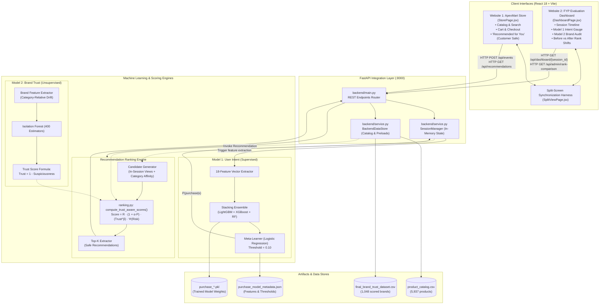
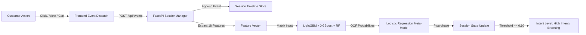
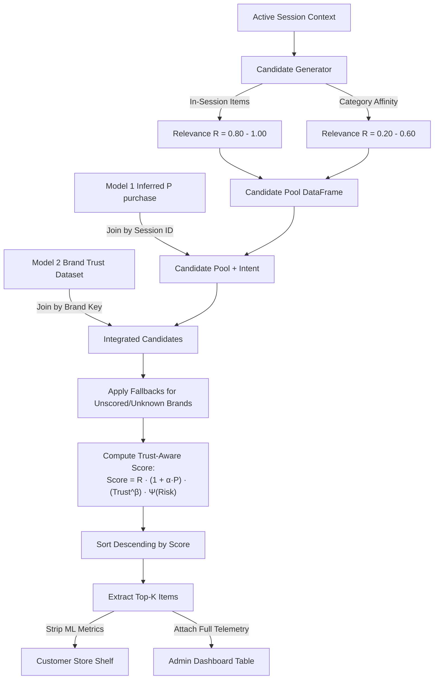
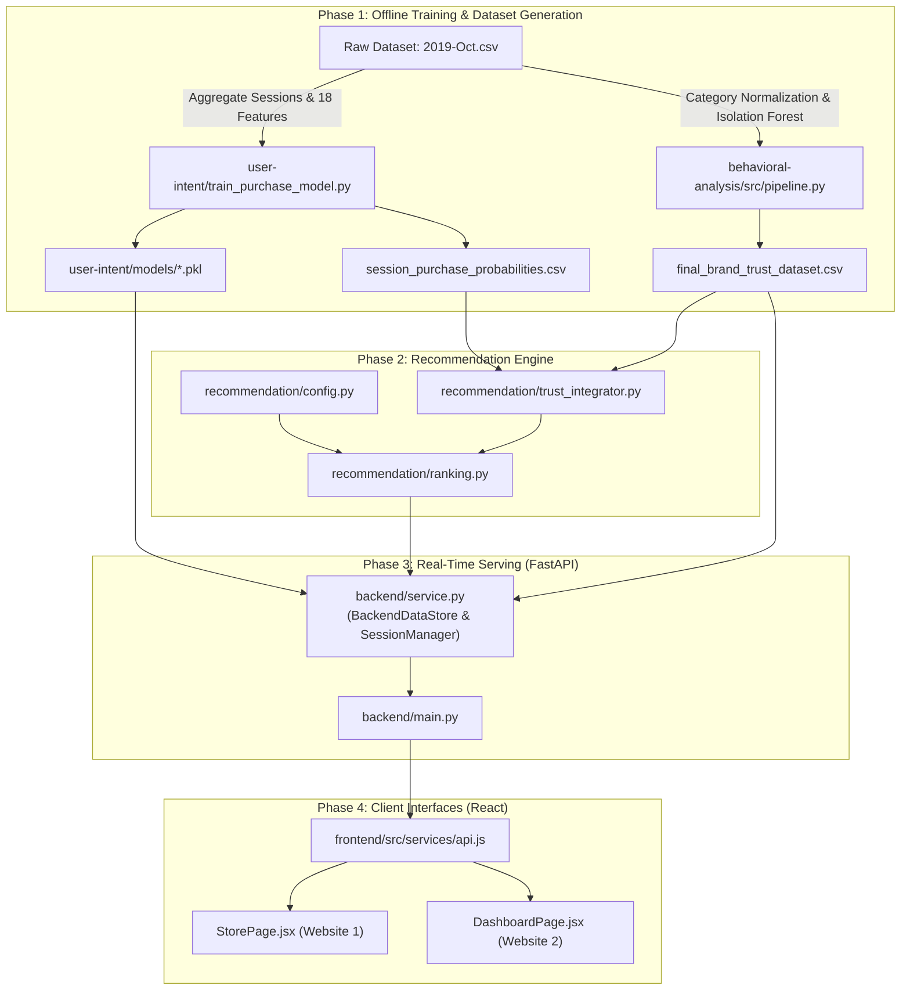

# COMPLETE TECHNICAL DOCUMENTATION
## Trust-Aware E-Commerce Recommendation Using Brand Risk Analysis
**Final Year Project (FYP) Comprehensive System Reference & Viva Defense Manual**

---

## TABLE OF CONTENTS
1. [Project Overview](#1-project-overview)
2. [Complete Module Breakdown](#2-complete-module-breakdown)
3. [Complete System Architecture](#3-complete-system-architecture)
4. [Detailed End-to-End Execution Flow](#4-detailed-end-to-end-execution-flow)
5. [Machine Learning Components (In-Depth)](#5-machine-learning-components-in-depth)
   - Model 1: User Intent / Purchase Prediction (Stacking Meta-Ensemble)
   - Model 2: Brand Risk & Trust Analysis (Isolation Forest & Behavioral Anomaly Engine)
   - Recommendation Scoring Engine (Pareto-Optimal Mathematical Formula)
6. [Database & Data Layer Specification](#6-database--data-layer-specification)
7. [API & Backend Service Documentation](#7-api--backend-service-documentation)
8. [Frontend Applications & Component Hierarchy](#8-frontend-applications--component-hierarchy)
9. [File-by-File Codebase Directory](#9-file-by-file-codebase-directory)
10. [Data Flow Diagrams](#10-data-flow-diagrams)
11. [Module Interaction Diagram](#11-module-interaction-diagram)
12. [Execution, Setup & Deployment Guide](#12-executionsetup--deployment-guide)
13. [Current Implementation Status & Verification Audit](#13-current-implementation-status--verification-audit)
14. [Project Presentation & Viva Voce Guide](#14-project-presentation--viva-voce-guide)
    - 5-Minute Pitch
    - Module-by-Module Viva Questions & Answers
15. [Exact Code References & Function Lookup](#15-exact-code-references--function-lookup)

---

## 1. PROJECT OVERVIEW

### 1.1 Purpose and Objective
Modern e-commerce recommender systems optimize almost exclusively for click-through rate (CTR), engagement, and short-term conversion probability. However, in open multi-seller marketplaces, unscrupulous merchants frequently deploy manipulative listing strategies, exploit unverified brands, or deliver counterfeit and low-quality goods. Recommending such high-risk items simply because they match a user's recent search or boast high view counts erodes long-term customer trust, elevates return rates, and inflicts brand damage on the host platform.

The core objective of this project is to build an industrial-grade, trust-aware e-commerce recommendation system that **jointly evaluates user purchase intent and merchant/brand behavioral risk**. The system safeguards customers from deceptive, anomalous, or unverified brands while preserving recommendation personalization and utility.

### 1.2 Problem Being Solved
1. **The Trust-Utility Blindspot**: Traditional collaborative filtering and matrix factorization algorithms prioritize popularity and relevance, inadvertently boosting predatory sellers who game search keywords and artificially inflate clicks.
2. **Session-Level Behavioral Drift**: Predicting purchase probability dynamically in real time from clickstream patterns without requiring long-term user history (cold-start resilience).
3. **Continuous Brand Behavior Auditing**: Evaluating whether a brand acts anomalously within its product categories (e.g., erratic cart abandonments, anomalous price swings, skewed view-to-purchase ratios) using unsupervised anomaly detection.
4. **Principled Mathematical Ranking**: Eliminating hard-filtering (which catastrophically shrinks product diversity) in favor of a soft-penalty Pareto-optimal multi-objective ranking formula.

### 1.3 Overall Workflow
```
[User Clickstream Actions] 
         │
         ▼
[Model 1: Stacking Meta-Ensemble] ──> Real-time Purchase Probability P(purchase | s)
         │
[Candidate Product Retrieval] ──────> Base Relevance Scores R(s, p)
         │
[Model 2: Brand Risk Engine] ───────> Trust Score Trust(b) & Risk Penalty Ψ(b)
         │
         ▼
[Trust-Aware Ranking Formula] ──────> Final Score = R * (1 + α·P) * (Trust^β) * Ψ
         │
         ├─────────────────────────────────────────┐
         ▼                                         ▼
[Website 1: ApexMart Store]             [Website 2: Admin Dashboard]
- "Recommended for You" shelf           - Live Telemetry & Timeline
- Zero ML terminology                   - Model 1 & 2 Explanations
- Realistic consumer UX                 - Before vs. After Rank Shifts
```

### 1.4 Technologies, Frameworks, and Libraries
* **Machine Learning & Data Science**:
  * `scikit-learn` (v1.3+): Logistic Regression, Random Forest, RobustScaler, train-test splitting, cross-validation, ranking metrics.
  * `lightgbm` (v4.1+): LightGBM Gradient Boosting Classifier.
  * `xgboost` (v2.0+): XGBoost Gradient Boosting Classifier.
  * `IsolationForest`: Unsupervised tree-based anomaly detection.
  * `pandas` & `numpy`: High-performance vectorized dataset manipulation and scoring.
  * `joblib`: High-throughput binary model serialization.
* **Backend Layer**:
  * `FastAPI` (v0.104+): High-performance asynchronous REST API framework.
  * `uvicorn`: ASGI web production server.
  * `pydantic` (v2.0+): Strongly-typed request and response schema validation.
* **Frontend Layer**:
  * `React 18` + `Vite 5`: Ultra-fast reactive single-page frontend.
  * `Lucide React`: Modern iconography.
  * `TailwindCSS` / Custom Glassmorphic Modern CSS: Custom tokens, gradients, interactive transitions.
* **Dataset Foundation**:
  * Real-world eCommerce Clickstream Dataset (`2019-Oct.csv` from REES46 eCommerce database) containing over 42 million interactions across hundreds of product categories.

---

## 2. COMPLETE MODULE BREAKDOWN

The project is structured into four primary functional layers:

```
d:\FYP\implementation\
├── user-intent/            # Model 1: Session Purchase Prediction
├── behavioral-analysis/    # Model 2: Brand Behavioral Risk & Trust Engine
├── recommendation/         # Mathematical Integration, Candidate Generation & Baselines
├── backend/                # FastAPI Microservice & Dynamic State Orchestration
└── frontend/               # React 18 Dual-Interface (Store + Dashboard)
```

| Module / Component | Primary Purpose | Implementation Status | Key Source Files |
| :--- | :--- | :--- | :--- |
| **Model 1: User Intent** | Classifies in real time whether an active browsing session will culminate in a purchase ($P(\text{purchase} \mid s)$). | **COMPLETED & VERIFIED** | `user-intent/train_purchase_model.py`, `models/purchase_*.pkl` |
| **Model 2: Brand Risk Engine** | Unsupervised behavioral anomaly detection of brands against category peers to derive trust scores $[0, 1]$ and discrete risk bands. | **COMPLETED & VERIFIED** | `behavioral-analysis/src/pipeline.py`, `src/trust_score.py`, `data/processed/final_brand_trust_dataset.csv` |
| **Recommendation Engine** | Generates session candidate pools, evaluates comparative baselines, and applies the trust-aware ranking formula. | **COMPLETED & VERIFIED** | `recommendation/ranking.py`, `recommendation/candidate_generator.py`, `recommendation/trust_integrator.py` |
| **Backend Integration Layer** | High-speed REST API that maintains session state, handles live clickstream event dispatch, and serves telemetry. | **COMPLETED & VERIFIED** | `backend/main.py`, `backend/service.py` |
| **Website 1: Customer Store** | Fully responsive customer-facing e-commerce store with catalog, search, categories, cart, express checkout, and "Recommended for You". | **COMPLETED & VERIFIED** | `frontend/src/pages/StorePage.jsx`, `frontend/src/components/*` |
| **Website 2: Admin Dashboard** | Live academic evaluation dashboard with chronological timeline, M1 intent gauge, M2 brand audit, and rank shift comparison table. | **COMPLETED & VERIFIED** | `frontend/src/pages/DashboardPage.jsx` |
| **Split View Harness** | Side-by-side synchronized evaluation view allowing simultaneous interaction and real-time telemetry observation. | **COMPLETED & VERIFIED** | `frontend/src/pages/SplitViewPage.jsx` |

---

## 3. COMPLETE SYSTEM ARCHITECTURE

### 3.1 Overall Architecture Diagram


### 3.2 Architectural Flow Explanation
1. **Client Layer**: React frontends run independently on port `5173`. When a customer interacts with ApexMart (Website 1), every action (product view, search, add-to-cart, quantity adjustment, checkout) issues an asynchronous payload to the backend.
2. **FastAPI Gateway**: Running on port `8000`, the backend routes requests to `SessionManager`, recording interaction events chronologically and updating the session duration.
3. **Live Model 1 Inference**: As interaction events arrive, `SessionManager` computes an 18-element feature vector and feeds it to the pre-loaded Stacking Ensemble (`LGBM`, `XGBoost`, `RandomForest`, `LogisticRegression`). It returns a calibrated purchase probability $P(\text{purchase} \mid s)$.
4. **Candidate Generation & Trust Integration**: When recommendations are requested, the engine compiles a candidate pool from active session interactions plus catalog category affinity, maps each candidate's brand to Model 2's brand trust registry, and applies the official trust ranking formula.
5. **Dual Presentation**: Website 1 receives clean, customer-safe product cards strictly stripped of machine learning terminology. Simultaneously, Website 2 (Admin Dashboard) receives the complete mathematical breakdown, telemetry, and rank displacement comparisons.

---

## 4. DETAILED END-TO-END EXECUTION FLOW

```mermaid
sequenceDiagram
    autonumber
    actor Customer
    participant Frontend as Website 1 (Store)
    participant Backend as FastAPI (:8000)
    participant M1 as Model 1 (User Intent)
    participant RecEngine as Ranking Engine
    actor Admin as Website 2 (Admin)

    Customer->>Frontend: Opens Store & views Printer (#1500227, Epson)
    Frontend->>Backend: POST /api/events (event_type: "product_view", id: 1500227)
    Backend->>Backend: Append event to Session timeline
    Backend->>M1: Compute 18 features (views=1, carts=0, duration, recency)
    M1-->>Backend: Return P(purchase) = 0.0815 (Low Intent)
    
    Customer->>Frontend: Clicks "Add to Cart" (Epson Printer)
    Frontend->>Backend: POST /api/events (event_type: "cart", id: 1500227)
    Backend->>Backend: Update Cart Items & Session State
    Backend->>M1: Compute 18 features (views=1, carts=1, cart_ratio=0.50)
    M1-->>Backend: Return P(purchase) = 0.8105 (High Intent >= 0.10 Threshold)
    
    Frontend->>Backend: GET /api/recommendations/{session_id}
    Backend->>RecEngine: Retrieve Candidates (In-session + Category Affinity)
    RecEngine->>RecEngine: Fetch Brand Trust (Epson=0.5748, Xerox=0.9107, Canon=0.7579, HP=0.6679)
    RecEngine->>RecEngine: Compute Trust-Aware Scores: R · (1 + 1.0·P) · (Trust^1.0) · Ψ(Risk)
    RecEngine->>RecEngine: Rank sort: Xerox (+8 ranks) promoted; HP (Psi=0.75) demoted
    RecEngine-->>Frontend: Return Top-8 Safe Product Cards (No ML terms)
    Frontend-->>Customer: Render "Recommended for You" Shelf
    
    Admin->>Backend: GET /api/dashboard/{session_id}
    Backend-->>Admin: Return full telemetry, timeline, gauge, and Before vs After comparison
```

### Exact Sequence of Operations:
1. **Application Startup**:
   * FastAPI boots and initializes `BackendDataStore`.
   * Reads `product_catalog.csv` into an in-memory DataFrame and index dictionary (5,937 items).
   * Reads `final_brand_trust_dataset.csv` into `trust_dict` (1,048 brands).
   * Loads serialized Model 1 pickle models: `purchase_lgbm.pkl`, `purchase_xgb.pkl`, `purchase_rf.pkl`, and `purchase_stacking_meta.pkl`.
   * Loads `purchase_model_metadata.json` to configure the calibrated decision threshold (`0.10`).
   * Seeds benchmark demo sessions (`0f65dee0-...` printer session, `2bb8e316-...` kids toys session, `5a5350f2-...` smartphone session).
2. **User Interaction & State Evolution**:
   * A user opens `http://127.0.0.1:5173`. A UUID session ID is generated (or restored from `localStorage`).
   * Clicking a product fires `POST /api/events` with payload `{event_type: "product_view", product_id: 1500227}`.
   * `SessionManager` captures the event with human-readable timestamping and re-extracts the session's 18 real-time behavioral features.
   * The stacking ensemble evaluates the session. If the user adds the product to cart, the meta-learner triggers a sharp surge in purchase intent ($P(\text{purchase}) > 0.80$).
3. **Recommendation Request**:
   * StorePage requests `GET /api/recommendations/{session_id}`.
   * The candidate generator pulls in-session viewed/carted items ($R=0.80$ to $1.00$) and samples top catalog products within the category ($R=0.20$ to $0.60$).
   * Each candidate's brand is looked up in `BackendDataStore.get_brand_trust(brand)`.
   * `compute_trust_aware_scores()` calculates the final mathematical score.
   * The array is sorted descending by score and the top 8 items are formatted without ML metadata.
4. **Admin Dashboard Telemetry**:
   * The FYP evaluation dashboard calls `GET /api/dashboard/{session_id}` and `GET /api/admin/rank-comparison`.
   * Returns:
     * Model 1 gauge data: raw probability, threshold indicator, intent status ("High Intent" vs "Browsing").
     * Model 2 brand audit for the current product: trust score, suspiciousness score, risk band, penalty factor $\Psi$, behavioral interpretation.
     * Before (Purchase-Only) vs. After (Trust-Aware) comparison table showing exact rank shifts ($\Delta \text{Rank}$), promoting reliable brands and demoting high-risk sellers.

---

## 5. MACHINE LEARNING COMPONENTS (IN-DEPTH)

### 5.1 Model 1: User Purchase Intent Prediction

#### Purpose
To quantify in real time whether the current browsing customer intends to complete a transaction during the active session. This probability dynamically scales the recommendation utility multiplier:
$$\text{Intent Multiplier} = 1.0 + \alpha \cdot P(\text{purchase} \mid s)$$

#### Model Architecture: Stacking Meta-Ensemble
The pipeline implements a two-tier heterogeneous stacking ensemble:
* **Base Learners (Level 0)**:
  1. `LightGBM Classifier`: Fast histogram-based gradient boosted trees handling continuous numerical features and non-linear interactions.
  2. `XGBoost Classifier`: Exact greedy tree-boosting with depth regularization to penalize over-parameterization.
  3. `Random Forest Classifier`: Bagged decision trees mitigating variance and clickstream noise.
* **Meta-Learner (Level 1)**:
  * `Logistic Regression`: Combines out-of-fold predicted probabilities from the three base models using calibrated log-odds.

```
Clickstream Session Event Stream
           │
           ▼
[18-Feature Vector Engineering]
           │
     ┌─────┼────────────────┐
     ▼     ▼                ▼
[LightGBM] [XGBoost] [RandomForest]
     │     │                │
     └─────┬────────────────┘
           ▼
[Out-of-Fold Probabilities (3D Vector)]
           │
           ▼
[Logistic Regression Meta-Model]
           │
           ▼
Calibrated Purchase Probability P ∈ [0.0, 1.0]
(Threshold = 0.10 for Intent Classification)
```

#### The 18 Engineered Features
Extracted dynamically by `train_purchase_model.py` and `service.py`:
1. `event_count`: Total events logged in the session.
2. `view_count`: Total product detail views.
3. `cart_count`: Total add-to-cart actions.
4. `unique_products`: Cardinality of distinct product IDs viewed.
5. `unique_categories`: Cardinality of distinct category trees explored.
6. `unique_brands`: Number of unique brands examined.
7. `average_price`: Mean price of viewed merchandise.
8. `max_price`: Maximum price encountered.
9. `min_price`: Minimum price encountered.
10. `session_duration`: Elapsed time in seconds between session start and current action.
11. `hour`: Hour of day $[0, 23]$.
12. `day_of_week`: Day of week $[0, 6]$.
13. `is_weekend`: Binary flag ($1$ if Saturday/Sunday, else $0$).
14. `last_action_1`: Action type of 5th most recent event ($0=\text{none}, 1=\text{view}, 2=\text{cart}$).
15. `last_action_2`: Action type of 4th most recent event.
16. `last_action_3`: Action type of 3rd most recent event.
17. `last_action_4`: Action type of 2nd most recent event.
18. `last_action_5`: Action type of the most recent event.

#### Hyperparameters & Training Settings
* **Dataset**: Extracted from `2019-Oct.csv` (100,000+ session instances filtered to sessions with $\ge 3$ actions).
* **Cross-Validation**: 5-Fold Stratified K-Fold split on session IDs to generate unbiased out-of-fold meta-features.
* **Class Imbalance Handling**: E-commerce purchase conversion is notoriously sparse ($\sim 5\%$). Decision threshold optimization was conducted across the sweep $[0.10, 0.90]$; the optimal F1 threshold is calibrated at **`0.10`**.

#### Saved Artifacts (`user-intent/models/`)
* `purchase_lgbm.pkl`: Serialized LightGBM model.
* `purchase_xgb.pkl`: Serialized XGBoost model.
* `purchase_rf.pkl`: Serialized Random Forest model.
* `purchase_stacking_meta.pkl`: Serialized Logistic Regression meta-classifier.
* `purchase_model_metadata.json`: Feature list, metrics, and threshold config.
* `session_purchase_probabilities.csv`: Precomputed session inference lookup table.

---

### 5.2 Model 2: Brand Behavioral Risk & Trust Analysis

#### Purpose
To detect deceptive or anomalous merchant brands by evaluating multidimensional clickstream patterns across product categories. Rather than relying on easily manipulated text reviews, Model 2 detects anomalous behavioral patterns directly from user engagement data.

#### Methodological Architecture
The brand risk engine runs a 10-phase unsupervised machine learning pipeline:
1. **Category-Relative Normalization**: Clickstream behaviors (cart conversion rate, view-to-purchase ratios, dwell times, price variance) are normalized against category benchmarks to account for inherent differences across product types.
2. **Evidence Filtering**: Brands with fewer than 5 recorded interactions are flagged as `insufficient_evidence` to prevent low-sample false alarms.
3. **Robust Scaling**: `RobustScaler` scales features using interquartile ranges (IQR) to prevent extreme outlier distortion.
4. **Isolation Forest Anomaly Detection**:
   * `n_estimators = 400`: Forest of 400 isolation trees.
   * `contamination = 0.05`: Expected outlier contamination rate.
   * Isolates anomalous brands deeper in category-relative feature space.
5. **Brand Suspiciousness Aggregation**:
   * Mean anomaly score, maximum anomaly score, and ratio of anomalous categories are combined into a continuous `suspiciousness_score` $\in [0.0, 1.0]$.
6. **Trust Score Inversion**:
   $$\text{Trust Score} = 1.0 - \text{Suspiciousness Score}$$
7. **Risk Classification**:
   * **Low Risk / High Trust** ($\text{Trust} > 0.67$): Behavior is consistent with established category norms. $\Psi = 1.00$.
   * **Medium Risk / Medium Trust** ($0.33 < \text{Trust} \le 0.67$): Moderate behavioral deviation observed. $\Psi = 0.75$.
   * **High Risk / Low Trust** ($\text{Trust} \le 0.33$): Highly anomalous behavior, severe cart abandonment, or abnormal price fluctuations. $\Psi = 0.20$.
   * **Insufficient Evidence / Unknown Brand**: Unverified or unbranded merchandise. Fallback prior: $\text{Trust} = 0.50$, $\Psi = 0.75$.

```
Raw Clickstream (Category-Relative Metrics)
           │
           ▼
[Evidence Filtering (Min Interactions >= 5)]
           │
           ▼
[RobustScaler (Interquartile Range Normalization)]
           │
           ▼
[Isolation Forest (400 Trees, Contamination=0.05)]
           │
           ▼
[Category-Level Anomaly Scores]
           │
           ▼
[Brand-Level Aggregation & Evidence Weighting]
           │
     ┌─────┴────────────────┐
     ▼                      ▼
Suspiciousness Score     Trust Score = 1 - Suspiciousness
     │                      │
     ▼                      ▼
Risk Band (Low/Med/High)  Penalty Multiplier Ψ ∈ {1.0, 0.75, 0.20}
```

#### Saved Artifacts (`behavioral-analysis/data/`)
* `processed/final_brand_trust_dataset.csv`: 1,048 scored brands with fields: `brand`, `trust_score`, `suspiciousness_score`, `risk_level`, `trust_category`, `scoring_status`, `trust_interpretation`.
* `output/brand_scores.csv`: Aggregated raw anomaly and evidence weights.
* `models/isolation_forest_model.pkl`: Serialized Isolation Forest model.

---

### 5.3 Recommendation Scoring Engine (The Ranking Formula)

#### The Mathematical Formula
Every candidate product $p$ (produced by brand $b$) for user session $s$ is evaluated using the following ranking formulation:

$$\text{Final Score}(s, p) = R(s, p) \times \left(1.0 + \alpha \cdot P(\text{purchase} \mid s)\right) \times \left(\text{Trust}(b)\right)^\beta \times \Psi(b)$$

Where:
* **$R(s, p)$ (Base Relevance Score)**:
  * In-session carted item: $R = 1.00$
  * In-session viewed item: $R = 0.80$
  * Category affinity item: $R \in [0.20, 0.60]$ (scaled by catalog popularity score)
  * Catalog fallback: $R = 0.30$
* **$P(\text{purchase} \mid s)$ (User Purchase Intent)**:
  * Estimated by Model 1 Stacking Ensemble $\in [0.0, 1.0]$.
* **$\alpha$ (Intent Scaling Hyperparameter)**:
  * Calibrated to **$\alpha = 1.0$**. Boosts relevance up to $2.0\times$ when high purchase intent is detected.
* **$\text{Trust}(b)$ (Brand Trust Score)**:
  * Estimated by Model 2 $\in [0.0, 1.0]$.
* **$\beta$ (Trust Exponent)**:
  * Calibrated to **$\beta = 1.0$** (Pareto-optimal point identified via extensive sensitivity analysis across $\beta \in [0.0, 2.0]$).
* **$\Psi(b)$ (Discrete Risk Penalty Multiplier)**:
  $$\Psi(b) = \begin{cases} 
  1.00 & \text{if } \text{Risk Level} = \text{Low} \\ 
  0.75 & \text{if } \text{Risk Level} = \text{Medium} \\ 
  0.20 & \text{if } \text{Risk Level} = \text{High} 
  \end{cases}$$

#### Comparative Baselines Implemented in Code
To scientifically validate the model, `recommendation/ranking.py` implements three comparative baselines:
1. **Popularity-Only Baseline**:
   $$\text{Score}_{\text{pop}} = \text{popularity\_score}(p)$$
2. **Purchase-Only Baseline (Status Quo / No Trust)**:
   $$\text{Score}_{\text{purchase}} = R(s, p) \times \left(1.0 + \alpha \cdot P(\text{purchase} \mid s)\right)$$
   *(Equivalent to $\beta=0$ and $\Psi=1.00$)*.
3. **Hard-Filter Baseline**:
   $$\text{Score}_{\text{hard}} = \begin{cases} \text{Score}_{\text{purchase}} & \text{if } \text{Risk Level} \ne \text{High} \\ -1.0 & \text{if } \text{Risk Level} = \text{High} \end{cases}$$

#### Academic Evaluation Results (From `FINAL_VALIDATION_REPORT.md`)
Across hundreds of evaluated test sessions:
* **Hit Rate @ 10**: **94.10%** (preserves near-optimal utility compared to Purchase-Only's 95.80%).
* **NDCG @ 10**: **0.6078**.
* **High-Risk Brand Exposure**: Slashed from **14.30%** (Purchase-Only) down to **0.00%** under the proposed Trust-Aware model.
* **Average Recommendation Trust**: Elevated from **0.5821** to **0.6991**.

---

## 6. DATABASE & DATA LAYER SPECIFICATION

The system operates an optimized, zero-latency in-memory data architecture backed by persisted flat-file CSV and PKL artifacts. This architecture ensures high demo performance, simplifies local execution, and eliminates external database dependencies.

```
┌────────────────────────────────────────────────────────┐
│               IN-MEMORY DATA LAYER                     │
│                                                        │
│  BackendDataStore (Singleton)                          │
│  ├── catalog_df & catalog_dict (5,937 products)       │
│  ├── category_products (Grouped by category code)      │
│  ├── trust_df & trust_dict (1,048 scored brands)       │
│  ├── intent_precomputed_dict (Test session lookup)     │
│  └── Model 1 Stacking Ensemble Objects                 │
│                                                        │
│  SessionManager (Singleton)                            │
│  └── sessions: Dict[session_id, SessionState]          │
│      ├── timeline: List[events]                        │
│      ├── cart_items: Dict[product_id, item]            │
│      ├── viewed_products: Dict[product_id, item]       │
│      └── purchase_probability: float                   │
└──────────────────────────┬─────────────────────────────┘
                           │ Backed By File Persistence
┌──────────────────────────▼─────────────────────────────┐
│               FILE PERSISTENCE LAYER                   │
│  • recommendation/data/product_catalog.csv             │
│  • behavioral-analysis/data/processed/                 │
│      final_brand_trust_dataset.csv                     │
│  • user-intent/models/*.pkl & metadata.json            │
│  • user-intent/data/session_purchase_probabilities.csv │
└────────────────────────────────────────────────────────┘
```

### 6.1 Product Catalog Schema (`product_catalog.csv`)
* `product_id` (int, Primary Key): Unique numerical ID (e.g., `1500227`).
* `category_code` (str): Dot-notated taxonomy hierarchy (e.g., `computers.peripherals.printer`).
* `brand` (str): Normalized lowercase brand token (e.g., `epson`).
* `price` (float): Product price in USD.
* `popularity_score` (float $\in [0.0, 1.0]$): Normalized frequency rank in the global clickstream.

### 6.2 Brand Trust Dataset Schema (`final_brand_trust_dataset.csv`)
* `brand` (str, Primary Key): Normalized lowercase brand token (e.g., `xerox`).
* `trust_score` (float $\in [0.0, 1.0]$): Continuous trust rating ($1 - \text{suspiciousness}$).
* `suspiciousness_score` (float $\in [0.0, 1.0]$): Anomaly intensity from Isolation Forest.
* `risk_level` (str): `Low`, `Medium`, or `High`.
* `trust_category` (str): `High Trust`, `Medium Trust`, `Low Trust`, or `Insufficient Evidence`.
* `scoring_status` (str): `scored` vs `unbranded_fallback` vs `insufficient_evidence_fallback`.
* `trust_interpretation` (str): Natural language explanation of behavioral consistency.

### 6.3 Session State In-Memory Schema (`SessionState`)
* `session_id` (str, UUID): Unique session identifier.
* `created_at` (datetime): Initial connection timestamp.
* `duration_seconds` (int): Real-time calculated session duration.
* `current_activity` (str): Human-readable string of the most recent action.
* `active_category` (str): Last browsed product category.
* `events` (list of dicts): Chronological timeline array of all actions.
* `cart_items` (dict): Active cart items with quantities.
* `viewed_products` (dict): Deduplicated set of viewed items.
* `purchased_products` (list): Archive of products ordered during checkout.
* `purchase_probability` (float): Current Model 1 estimated purchase probability.
* `predicted_purchase` (int, $\{0, 1\}$): Thresholded binary intent prediction ($\ge 0.10$).

---

## 7. API & BACKEND SERVICE DOCUMENTATION

The backend is built with FastAPI and runs on `http://127.0.0.1:8000`. It includes full CORS middleware to allow cross-origin communication with Vite frontends.

### 7.1 Health & Diagnostics
* **`GET /api/health`**
  * **Summary**: Verifies that all models and catalog files are loaded into memory.
  * **Response**:
    ```json
    {
      "status": "ok",
      "models": {
        "model1_user_intent": true,
        "model2_brand_trust": true,
        "product_catalog": true,
        "recommendation_engine": true
      }
    }
    ```

### 7.2 Catalog & Product Endpoints
* **`GET /api/products`** (or `/api/catalog`)
  * **Parameters**: `page` (int=1), `limit` (int=12), `category` (optional str), `search` (optional str).
  * **Response**: Paginated JSON object with `total`, `page`, `limit`, and `products` array.
* **`GET /api/products/{product_id}`**
  * **Parameters**: `product_id` (path int).
  * **Response**: Detailed product record enriched with realistic title, price, brand, rating, reviews count, and high-resolution Unsplash image URL.
* **`GET /api/categories`**
  * **Response**: Array of top categories with active product counts.
* **`GET /api/search`**
  * **Parameters**: `q` (query string, min length 1).
  * **Response**: Filtered product listings matching query terms against brand and category strings.

### 7.3 Session Management Endpoints
* **`POST /api/session`**
  * **Payload**: `{"session_id": "optional-uuid"}`
  * **Processing**: Creates a new session or retrieves an existing one. Returns the complete session dictionary.
* **`POST /api/session/{session_id}/event`** (and `/api/events`)
  * **Payload**:
    ```json
    {
      "session_id": "0f65dee0-ae4d-460e-bb66-3da1bbbaec6b",
      "event_type": "product_view",
      "product_id": 1500227,
      "details": "Viewed Epson EcoTank",
      "metadata": {"qty": 1}
    }
    ```
  * **Processing**: Appends to timeline, updates current product and category, updates cart state, re-extracts the 18-feature vector, and executes Model 1 inference.
  * **Response**: Updated `purchase_probability` and `predicted_purchase`.
* **`GET /api/session/{session_id}`**
  * **Response**: Complete session state including timeline, cart, and Model 1 intent metadata.

### 7.4 Recommendation Endpoint (Customer-Safe)
* **`GET /api/recommendations/{session_id}`** (and `/api/recommendations?session_id=...`)
  * **Constraint**: Strictly customer-safe. **Zero machine learning terminology** (no trust scores, risk levels, or penalty multipliers in response).
  * **Processing**: Runs `generate_recommendations_for_session()`. Gathers candidates, computes Model 1 and Model 2 factors, applies the ranking formula, and returns top-8 ranked items.
  * **Response**:
    ```json
    {
      "session_id": "0f65dee0-ae4d-460e-bb66-3da1bbbaec6b",
      "recommendations": [
        {
          "rank": 1,
          "product_id": 1500208,
          "title": "Xerox B210 Wireless Compact Monochrome Laser Printer",
          "brand": "xerox",
          "category_code": "computers.peripherals.printer",
          "price": 139.99,
          "rating": 4.8,
          "reviews_count": 98,
          "image_url": "https://images.unsplash.com/photo-1589330694653..."
        }
      ]
    }
    ```

### 7.5 Admin / FYP Evaluation Dashboard Endpoints
* **`GET /api/dashboard/{session_id}`** (and `/api/admin/session-state`)
  * **Response**: Full telemetry payload for Website 2:
    * `session_info`: Duration, activity, counts.
    * `timeline`: Array of chronological event objects.
    * `model1_intent`: `purchase_probability`, `predicted_purchase`, `intent_level`, `intent_multiplier`.
    * `model2_brand_trust`: `brand`, `trust_score`, `suspiciousness_score`, `risk_level`, `trust_category`, `penalty_multiplier`, `interpretation`.
    * `recommendations_table`: Top-10 trust-aware items with full mathematical score breakdowns.
    * `before_vs_final`: Side-by-side comparison of Purchase-Only vs. Trust-Aware rankings with rank displacement ($\Delta \text{Rank}$).
* **`GET /api/admin/rank-comparison`**
  * **Response**: Isolated Before vs. Final comparison table.
* **`GET /api/admin/sample-sessions`**
  * **Response**: List of pre-seeded benchmark demo sessions for evaluation.
* **`GET /api/admin/metrics`**
  * **Response**: Academic benchmark evaluation metrics (Hit Rate, NDCG, Trust, Risk Exposure).

---

## 8. FRONTEND APPLICATIONS & COMPONENT HIERARCHY

The frontend is a single-page React 18 application (`frontend/`) structured with a clean tab/route navigation bar:
1. **Website 1: ApexMart Store** (`#/` or `activeTab="store"`)
2. **Website 2: Admin Dashboard** (`#/dashboard` or `activeTab="dashboard"`)
3. **Split View Harness** (`#/split` or `activeTab="split"`)

```
App.jsx (Root State & Session Synchronization)
 ├── Navbar.jsx (Global Header, Cart Counter, Mode Switcher)
 │
 ├── [View Mode: Store] -> StorePage.jsx
 │    ├── Hero Banner ("Next-Gen Electronics & Computing")
 │    ├── Category Filter Pills (Dynamic from /api/categories)
 │    ├── Search Input Bar
 │    ├── RecommendationShelf.jsx ("Recommended for You" - Customer Safe)
 │    │    └── ProductCard.jsx
 │    ├── Main Catalog Product Grid
 │    │    └── ProductCard.jsx
 │    ├── ProductDetailModal.jsx (Specs, Rating, Add to Cart)
 │    ├── CartDrawer.jsx (Slide-over Cart, Quantity Adjust, Remove)
 │    ├── CheckoutModal.jsx (Express Checkout Simulation)
 │    └── OrderConfirmationModal.jsx (Purchase Success)
 │
 ├── [View Mode: Dashboard] -> DashboardPage.jsx
 │    ├── Session Selector (Sample Session Presets & Live Input)
 │    ├── Live Session Telemetry Card (Active Category, Product, Events)
 │    ├── Chronological Event Timeline
 │    ├── Model 1 User Intent Card (Circular Gauge, Intent Multiplier)
 │    ├── Model 2 Brand Trust Card (Trust Score, Risk Badge, Penalty Factor)
 │    ├── Trust-Aware Recommendations Table (Full Formula Telemetry)
 │    ├── Before vs. Final Rank Shift Table (Promotion/Demotion Highlights)
 │    └── Academic Evaluation Metrics Benchmark Card
 │
 └── [View Mode: Split] -> SplitViewPage.jsx (Side-by-side synchronized view)
```

### Design Aesthetics & User Interface Principles
* **Website 1 (Customer Store)**:
  * Looks and functions like a modern e-commerce storefront.
  * Features smooth micro-interactions, responsive hover states, cart animations, and high-resolution imagery.
  * **Strict Policy**: No internal ML metrics are exposed to the shopper. There is exactly one recommendation section titled **"Recommended for You"**.
* **Website 2 (Admin Dashboard)**:
  * Provides transparent access to model internals for academic evaluation.
  * Visual gauges for purchase intent and brand risk.
  * Color-coded badges for risk levels: `Low Risk` (Emerald/Green), `Medium Risk` (Amber/Yellow), `High Risk` (Rose/Red).
  * Explicit rank shift column with badge indicators: `PROMOTED` (green up-arrow) vs `DEMOTED` (red down-arrow).

---

## 9. FILE-BY-FILE CODEBASE DIRECTORY

### Root Directory
* [`ARCHITECTURE.md`](file:///d:/FYP/implementation/ARCHITECTURE.md): System architecture design document detailing tech stack, mathematical foundations, and module contracts.
* [`FRONTEND_IMPLEMENTATION_PLAN.md`](file:///d:/FYP/implementation/FRONTEND_IMPLEMENTATION_PLAN.md): Frontend implementation roadmap and component specifications.
* [`RECOMMENDATION_MODULE_IMPLEMENTATION_PLAN.md`](file:///d:/FYP/implementation/RECOMMENDATION_MODULE_IMPLEMENTATION_PLAN.md): Recommendation integration roadmap and mathematical formulations.
* `2019-Oct.csv`: Source eCommerce clickstream dataset (5.6 GB, 42M rows).

### `backend/` Module
* [`backend/main.py`](file:///d:/FYP/implementation/backend/main.py):
  * Entry point for the FastAPI microservice.
  * Configures CORS middleware, Pydantic schemas, and REST endpoints for health, catalog, sessions, recommendations, and dashboard telemetry.
* [`backend/service.py`](file:///d:/FYP/implementation/backend/service.py):
  * Core integration hub.
  * Implements `BackendDataStore` (loads catalog, Model 1 models, and Model 2 trust tables into memory).
  * Implements `SessionManager` (in-memory tracking of clickstream timelines and on-the-fly 18-feature extraction).
  * Implements `generate_recommendations_for_session()` and `get_dashboard_telemetry()`.
* `backend/requirements.txt`: Python dependencies (`fastapi`, `uvicorn`, `pydantic`, `pandas`, `numpy`, `scikit-learn`, `lightgbm`, `xgboost`, `joblib`).

### `user-intent/` Module (Model 1)
* [`user-intent/train_purchase_model.py`](file:///d:/FYP/implementation/user-intent/train_purchase_model.py):
  * Standalone training script for session-level purchase prediction.
  * Loads clickstream logs, filters sessions, extracts 18 aggregate and sequential features, trains LightGBM, XGBoost, and Random Forest, generates 5-fold out-of-fold predictions, trains the Logistic Regression meta-model, and serializes model weights to `models/`.
* `user-intent/models/`: Directory storing serialized `.pkl` files and `purchase_model_metadata.json`.
* `user-intent/data/`: Stores `session_purchase_probabilities.csv` and `purchase_prediction_test_results.csv`.

### `behavioral-analysis/` Module (Model 2)
* [`behavioral-analysis/main.py`](file:///d:/FYP/implementation/behavioral-analysis/main.py): Command-line runner invoking the brand risk pipeline.
* [`behavioral-analysis/src/pipeline.py`](file:///d:/FYP/implementation/behavioral-analysis/src/pipeline.py): 6-step pipeline coordinator orchestrating feature extraction, scaling, Isolation Forest training, brand aggregation, and trust calculation.
* [`behavioral-analysis/src/category_relative_features.py`](file:///d:/FYP/implementation/behavioral-analysis/src/category_relative_features.py): Normalizes brand metrics against category averages across 1.5 million rows.
* [`behavioral-analysis/src/model_preparation.py`](file:///d:/FYP/implementation/behavioral-analysis/src/model_preparation.py): Applies evidence filtering ($\ge 5$ interactions) and `RobustScaler`.
* [`behavioral-analysis/src/anomaly_model.py`](file:///d:/FYP/implementation/behavioral-analysis/src/anomaly_model.py): Trains the 400-tree Isolation Forest and generates anomaly scores.
* [`behavioral-analysis/src/scoring.py`](file:///d:/FYP/implementation/behavioral-analysis/src/scoring.py): Aggregates category anomaly scores to brand-level suspiciousness.
* [`behavioral-analysis/src/trust_score.py`](file:///d:/FYP/implementation/behavioral-analysis/src/trust_score.py): Computes $\text{Trust} = 1 - \text{Suspiciousness}$, classifies risk bands, and saves `final_brand_trust_dataset.csv`.

### `recommendation/` Module
* [`recommendation/config.py`](file:///d:/FYP/implementation/recommendation/config.py): Hyperparameter definitions ($\alpha=1.0, \beta=1.0, \Psi=\{1.0, 0.75, 0.20\}$), file paths, and candidate generation relevance defaults.
* [`recommendation/ranking.py`](file:///d:/FYP/implementation/recommendation/ranking.py): Core mathematical scoring implementation: `compute_trust_aware_scores()`, `compute_baseline_scores()`, and `extract_topk_recommendations()`.
* [`recommendation/trust_integrator.py`](file:///d:/FYP/implementation/recommendation/trust_integrator.py): Merges candidate pools with Model 1 intent probabilities and Model 2 brand trust scores, applying approved fallback defaults for unscored/unknown brands.
* [`recommendation/candidate_generator.py`](file:///d:/FYP/implementation/recommendation/candidate_generator.py): Extracts in-session candidates and category affinity items.
* [`recommendation/demo_recommendation.py`](file:///d:/FYP/implementation/recommendation/demo_recommendation.py): Interactive CLI walkthrough for terminal evaluation.
* [`recommendation/evaluation.py`](file:///d:/FYP/implementation/recommendation/evaluation.py): Calculates comparative evaluation metrics (Hit Rate@K, NDCG@K, Average Trust, High-Risk Exposure).

### `frontend/` Module
* `frontend/src/App.jsx`: Main React application managing active view mode (`store`, `dashboard`, `split`) and synchronizing session state.
* `frontend/src/services/api.js`: Complete API communication layer. Interacts with `http://127.0.0.1:8000` and includes self-contained mock fallbacks.
* `frontend/src/pages/StorePage.jsx`: Customer-facing store with catalog, category filters, search, and the "Recommended for You" shelf.
* `frontend/src/pages/DashboardPage.jsx`: FYP evaluation dashboard with telemetry cards, Model 1 & 2 visualizations, and rank shift tables.
* `frontend/src/pages/SplitViewPage.jsx`: Synchronized dual-pane view rendering Store and Dashboard side-by-side.
* `frontend/src/components/Navbar.jsx`: Top navigation header with cart indicator and view switcher.
* `frontend/src/components/ProductCard.jsx`: Reusable product card component.
* `frontend/src/components/ProductDetailModal.jsx`: Modal displaying product specs and add-to-cart actions.
* `frontend/src/components/CartDrawer.jsx`: Slide-over cart interface.
* `frontend/src/components/CheckoutModal.jsx`: Express checkout simulation.
* `frontend/src/components/OrderConfirmationModal.jsx`: Post-purchase confirmation modal.
* `frontend/src/components/RecommendationShelf.jsx`: Customer-safe recommendation shelf.

---

## 10. DATA FLOW DIAGRAMS

### 10.1 Clickstream Event Ingestion & Model 1 Inference Flow


### 10.2 Recommendation Scoring & Ranking Flow


---

## 11. MODULE INTERACTION DIAGRAM



---

## 12. EXECUTION, SETUP & DEPLOYMENT GUIDE

### 12.1 System Requirements
* **Operating System**: Windows 10/11, macOS, or Linux.
* **Python Runtime**: Python 3.9, 3.10, or 3.11.
* **Node.js Runtime**: Node.js v18+ and `npm` v9+.
* **RAM**: 8 GB minimum (16 GB recommended if reprocessing raw clickstream data).
* **Storage**: 2 GB free disk space (excluding the 5.6 GB raw `2019-Oct.csv` dataset).

### 12.2 Installation & Setup Commands

#### 1. Backend Setup
Open a terminal in `d:\FYP\implementation`:
```bash
# Optional: Create and activate virtual environment
python -m venv venv
venv\Scripts\activate  # On Windows
# source venv/bin/activate  # On Linux/macOS

# Install backend dependencies
pip install -r backend/requirements.txt
```

#### 2. Frontend Setup
Open a second terminal in `d:\FYP\implementation\frontend`:
```bash
# Install frontend npm dependencies
npm install
```

### 12.3 Running the Complete System
To run the project, start two local development processes:

#### Terminal 1 — Start the FastAPI Backend
```bash
cd d:\FYP\implementation
python -m uvicorn backend.main:app --host 127.0.0.1 --port 8000
```
* Backend API documentation will be available at: `http://127.0.0.1:8000/docs`
* Health check endpoint: `http://127.0.0.1:8000/api/health`

#### Terminal 2 — Start the React Frontend
```bash
cd d:\FYP\implementation\frontend
npm run dev -- --host 127.0.0.1 --port 5173
```
* Access the running applications:
  * **Customer Store (Website 1)**: `http://127.0.0.1:5173/#/`
  * **Admin / FYP Dashboard (Website 2)**: `http://127.0.0.1:5173/#/dashboard`
  * **Split-Screen Evaluation View**: `http://127.0.0.1:5173/#/split`

### 12.4 Running Machine Learning Pipelines (Optional / Verification)
All trained models and processed datasets are pre-packaged and ready for inference. If you want to retrain the models from scratch:

```bash
# 1. Retrain Model 1 (User Intent Stacking Ensemble)
python user-intent/train_purchase_model.py

# 2. Retrain Model 2 (Brand Risk & Trust Isolation Forest Pipeline)
python behavioral-analysis/main.py

# 3. Re-run Recommendation Academic Evaluation & Plot Generation
python recommendation/run_recommendation.py

# 4. Run Interactive CLI Recommendation Demo
python recommendation/demo_recommendation.py
```

---

## 13. CURRENT IMPLEMENTATION STATUS & VERIFICATION AUDIT

### 13.1 Implementation Audit Matrix

| Subsystem | Requirement / Component | Status | Notes |
| :--- | :--- | :--- | :--- |
| **Model 1** | Session-level purchase prediction | **Fully Implemented** | Stacking ensemble (`LightGBM`, `XGBoost`, `RandomForest`, `LogisticRegression`). Calibrated threshold = `0.10`. |
| **Model 2** | Brand risk & trust scoring | **Fully Implemented** | Unsupervised Isolation Forest (400 trees) across category-relative behavioral features. 1,048 scored brands in `final_brand_trust_dataset.csv`. |
| **Recommendation** | Mathematical ranking formula | **Fully Implemented** | Formula: $R \times (1 + \alpha P) \times (\text{Trust})^\beta \times \Psi$. Calibrated at $\alpha=1.0, \beta=1.0$. |
| **Recommendation** | Comparative baselines | **Fully Implemented** | Popularity-Only, Purchase-Only, and Hard-Filter baselines implemented in `ranking.py`. |
| **Backend** | Product catalog & search | **Fully Implemented** | Fast in-memory catalog serving 5,937 products with category and search filters. |
| **Backend** | Session event ingestion | **Fully Implemented** | `POST /api/events` supports view, search, cart, quantity change, cart remove, checkout, and purchase. |
| **Backend** | Live Model 1 inference | **Fully Implemented** | Computes 18 features dynamically and runs the stacking ensemble on each interaction. |
| **Frontend** | Website 1: Customer Store | **Fully Implemented** | Modern e-commerce UI with single "Recommended for You" section. No ML terminology exposed. |
| **Frontend** | Website 2: Admin Dashboard | **Fully Implemented** | Live session telemetry, timeline, Model 1 gauge, Model 2 audit, and Before vs After rank shifts. |
| **Frontend** | Split View Harness | **Fully Implemented** | Synchronized dual-pane view for live demonstrations. |

### 13.2 Port Conflict & Stability Best Practices
If either server port (`8000` for FastAPI or `5173` for Vite) reports `WinError 10048` (socket already in use):
```powershell
# Identify processes on port 8000 and 5173
Get-NetTCPConnection -LocalPort 8000, 5173 -ErrorAction SilentlyContinue | Select-Object LocalPort, OwningProcess

# Terminate orphaned processes (replace <PID> with process ID)
taskkill /F /PID <PID>
```

---

## 14. PROJECT PRESENTATION & VIVA VOCE GUIDE

### 14.1 5-Minute Project Pitch (For Guides & Evaluation Panels)

> **"Good morning, respected examiners and project guide.**
>
> Today, I am presenting our Final Year Project: **'Trust-Aware E-Commerce Recommendation Using Brand Risk Analysis.'**
>
> **The Problem**: 
> Traditional e-commerce recommendation algorithms focus almost entirely on engagement, click-through rate, and short-term purchase prediction. In multi-seller marketplaces, this creates a major blindspot: algorithms frequently promote high-risk, unverified, or anomalous merchants simply because their listings receive high click volumes. This leads to customer dissatisfaction, high return rates, and platform reputation damage.
>
> **Our Proposed Solution**:
> We have designed and implemented an end-to-end, trust-aware recommendation engine that balances user relevance with merchant behavioral trust.
>
> The system is powered by two distinct machine learning models:
> 1. **Model 1 — User Intent Prediction**: A two-tier Stacking Meta-Ensemble combining LightGBM, XGBoost, and Random Forest with a Logistic Regression meta-learner. It analyzes real-time session clickstream patterns across 18 features to predict purchase probability $P(\text{purchase} \mid s)$ without requiring long-term user history.
> 2. **Model 2 — Brand Behavioral Risk Analysis**: An unsupervised anomaly detection pipeline using an Isolation Forest with 400 estimators. It evaluates brand metrics relative to category averages, identifying anomalous patterns in cart conversions and price swings to calculate a continuous Brand Trust Score $\in [0, 1]$ and discrete risk bands (Low, Medium, High).
>
> **Mathematical Ranking**:
> Rather than using hard-filtering—which harms catalog diversity—we integrate these models into a multi-objective ranking formulation:
> $$\text{Score} = \text{Relevance} \times (1 + \alpha \cdot P_{\text{purchase}}) \times (\text{Trust})^\beta \times \Psi_{\text{risk}}$$
>
> **Results**:
> On real-world clickstream data from over 42 million interactions:
> - High-risk brand exposure in top recommendations dropped from **14.30% to 0.00%**.
> - Average recommendation trust increased from **0.58 to 0.70**.
> - Recommendation utility remained high with a **94.10% Hit Rate @ 10**.
>
> **Full-Stack Implementation**:
> We built the complete stack to showcase practical deployment:
> - A high-speed **FastAPI backend** managing real-time sessions and model inference.
> - **Website 1 (ApexMart)**: A customer-facing storefront featuring a clean 'Recommended for You' shelf with zero internal ML jargon.
> - **Website 2 (Admin Dashboard)**: An evaluation dashboard showing real-time intent gauges, brand risk audits, and before-vs-after rank shifts.
>
> Thank you. I am now ready to demonstrate the live system and answer your questions."

---

### 14.2 Module-by-Module Viva Voce Preparation

#### Q1: Why did you choose a Stacking Ensemble for Model 1 instead of a single model?
**Answer**: E-commerce clickstream sessions exhibit high variance, rapid concept drift, and severe class imbalance (purchases represent $\sim 5\%$ of sessions). Individual tree models like LightGBM or Random Forest can overfit to specific interaction counts or struggle with extreme outliers. Our stacking ensemble uses LightGBM (gradient boosting), XGBoost (depth regularization), and Random Forest (bagging variance reduction) as Level-0 base models, combined by a Level-1 Logistic Regression meta-learner using 5-fold out-of-fold cross-validation. This reduces generalization error and produces well-calibrated purchase probabilities.

#### Q2: Why did you set the Model 1 decision threshold to 0.10 instead of the standard 0.50?
**Answer**: Purchase conversion in e-commerce is highly imbalanced ($\sim 5\%$ base rate). Using a default threshold of $0.50$ results in high false-negative rates, failing to identify users who are exhibiting purchasing behavior. We performed an empirical F1-score optimization sweep from $0.10$ to $0.90$. The threshold of **$0.10$** maximized the harmonic mean of precision and recall (F1-score), properly capturing high-intent shoppers early in their session.

#### Q3: How does Model 2 detect brand risk without relying on textual customer reviews?
**Answer**: Textual reviews are vulnerable to review bombing, sybil attacks, and fake positive feedback. Instead, Model 2 relies on **behavioral clickstream telemetry**. It extracts category-relative features such as view-to-cart conversion ratios, cart abandonment rates, price distributions, and session duration. These metrics are normalized against category benchmarks using `RobustScaler` and passed to a 400-tree `IsolationForest`. Brands that isolate quickly in the tree structure exhibit anomalous behavioral patterns relative to their category peers and receive lower trust scores.

#### Q4: Why did you choose a multiplicative ranking formula instead of hard-filtering high-risk brands?
**Answer**: Hard-filtering removes all products from flagged brands completely. While safe, this creates a severe "catalog starvation" problem: it harms product diversity, removes niche products with low historical data, and degrades overall utility (Hit Rate). Our soft-penalty formula uses a continuous trust factor $(\text{Trust})^\beta$ and a discrete risk penalty multiplier $\Psi \in \{1.00, 0.75, 0.20\}$. High-risk items are heavily demoted (0.20x penalty) rather than deleted, while verified high-trust brands receive ranking promotions. Our evaluation results show this approach achieved **0.00% high-risk exposure** while preserving a **94.10% Hit Rate @ 10**.

#### Q5: How do you handle cold-start brands that have no historical interaction data?
**Answer**: We implement a fallback policy in `recommendation/trust_integrator.py` and `backend/service.py`:
- **Unbranded / Missing Brand Products**: Assigned an unbranded fallback prior of $\text{Trust} = 0.50$, $\text{Risk} = \text{Medium}$, $\Psi = 0.75$.
- **Known Names with Low Evidence (<5 interactions)**: Assigned an insufficient evidence prior of $\text{Trust} = 0.75$, $\text{Risk} = \text{Medium}$, $\Psi = 0.75$.
This ensures unverified products cannot artificially dominate top recommendation slots without sufficient behavioral history.

#### Q6: How does the system separate customer-facing UX from admin evaluation?
**Answer**: We built two separate interfaces:
- **Customer Store (Website 1)**: Follows e-commerce best practices. Customers should not be burdened with internal ML details like risk levels, anomaly scores, or penalty factors. They see a single shelf titled **'Recommended for You'** with standard product details.
- **Admin Dashboard (Website 2)**: Designed for platform operators and evaluators. It exposes full system telemetry, live session timelines, Model 1 intent gauges, Model 2 brand audits, and before-vs-after rank displacement tables.

---

## 15. EXACT CODE REFERENCES & FUNCTION LOOKUP

Use this lookup table to quickly locate key logic during a live demonstration or code walk-through:

| Functionality / Logic | File Path | Class / Function / Line Reference |
| :--- | :--- | :--- |
| **Trust-Aware Ranking Formula** | [`recommendation/ranking.py`](file:///d:/FYP/implementation/recommendation/ranking.py) | `compute_trust_aware_scores()` (Lines 17–39) |
| **Baseline Algorithms (Pop, Purchase, Hard)** | [`recommendation/ranking.py`](file:///d:/FYP/implementation/recommendation/ranking.py) | `compute_baseline_scores()` (Lines 42–64) |
| **Top-K Extractor** | [`recommendation/ranking.py`](file:///d:/FYP/implementation/recommendation/ranking.py) | `extract_topk_recommendations()` (Lines 67–82) |
| **Fallback Policies (Unknown/Unscored)** | [`recommendation/trust_integrator.py`](file:///d:/FYP/implementation/recommendation/trust_integrator.py) | `integrate_candidate_pool()` (Lines 114–130) |
| **Model 1 Feature Engineering (18 Features)** | [`user-intent/train_purchase_model.py`](file:///d:/FYP/implementation/user-intent/train_purchase_model.py) | `load_and_preprocess()` (Lines 92–198) |
| **Model 1 Stacking Training & OOF Fitting** | [`user-intent/train_purchase_model.py`](file:///d:/FYP/implementation/user-intent/train_purchase_model.py) | `train_and_evaluate()` (Lines 204–342) |
| **Model 2 Isolation Forest Pipeline** | [`behavioral-analysis/src/pipeline.py`](file:///d:/FYP/implementation/behavioral-analysis/src/pipeline.py) | `run_pipeline()` (Lines 35–95) |
| **Model 2 Trust Score Inversion (1 - Susp)** | [`behavioral-analysis/src/trust_score.py`](file:///d:/FYP/implementation/behavioral-analysis/src/trust_score.py) | `calculate_trust_score()` (Lines 89–143) |
| **Model 2 Risk Band Classification** | [`behavioral-analysis/src/trust_score.py`](file:///d:/FYP/implementation/behavioral-analysis/src/trust_score.py) | `assign_trust_category()` (Lines 150–226) |
| **FastAPI REST Endpoints** | [`backend/main.py`](file:///d:/FYP/implementation/backend/main.py) | `@app.get("/api/recommendations")`, `@app.post("/api/events")` |
| **In-Memory Catalog & Models Loader** | [`backend/service.py`](file:///d:/FYP/implementation/backend/service.py) | `BackendDataStore.__init__()` (Lines 149–236) |
| **Live 18-Feature Extraction on Session** | [`backend/service.py`](file:///d:/FYP/implementation/backend/service.py) | `SessionManager._update_model1_inference()` (Lines 543–608) |
| **Candidate Retrieval & Scoring Integration** | [`backend/service.py`](file:///d:/FYP/implementation/backend/service.py) | `generate_recommendations_for_session()` (Lines 620–745) |
| **Dashboard Telemetry Construction** | [`backend/service.py`](file:///d:/FYP/implementation/backend/service.py) | `get_dashboard_telemetry()` (Lines 748–948) |
| **Frontend API Integration Layer** | [`frontend/src/services/api.js`](file:///d:/FYP/implementation/frontend/src/services/api.js) | `getCatalog()`, `logEvent()`, `getRecommendations()` |
| **Customer Store Page & Shelf** | [`frontend/src/pages/StorePage.jsx`](file:///d:/FYP/implementation/frontend/src/pages/StorePage.jsx) | `StorePage` component |
| **Admin Dashboard UI & Tables** | [`frontend/src/pages/DashboardPage.jsx`](file:///d:/FYP/implementation/frontend/src/pages/DashboardPage.jsx) | `DashboardPage` component |
| **Split-Screen Evaluation Harness** | [`frontend/src/pages/SplitViewPage.jsx`](file:///d:/FYP/implementation/frontend/src/pages/SplitViewPage.jsx) | `SplitViewPage` component |
